# 绸带

$$
\newcommand{\abs}[1]{\left\lvert#1\right\rvert}
\newcommand{\ang}[1]{\left\langle#1\right\rangle}
\newcommand{\norm}[1]{\left\lVert#1\right\rVert}
\newcommand{\inv}[1]{#1^{-1}}
\newcommand{\sign}[1]{\text{sign}(#1)}
\newcommand{\bd}[1]{\textbf{#1}}
\newcommand{\ip}[1]{\left\langle {#1}\right\rangle} % Inner Product
\newcommand{\enumalph}[0]{\begin{enumerate}[label=(\alph*)]}
\newcommand{\aut}[0]{\text{Aut}}
\newcommand{\inn}[0]{\text{Inn}}
\newcommand{\char}[0]{\text{ char }}
\newcommand{\gal}[0]{\text{Gal}}
\newcommand{\lp}[0]{\left(}
\newcommand{\rp}[0]{\right)}
\newcommand{\lb}[0]{\left\{}
\newcommand{\rb}[0]{\right\}}
\newcommand{\lbr}[0]{\left[}
\newcommand{\rbr}[0]{\right]}
\newcommand{\md}[0]{\mathrm{d}}
\newcommand{\F}[0]{\mathbb F}
$$

不要只抄书，要用自己的语言叙述出来

Group theory: to describe symmetries (structures) (and some actions)

要不去简单瞄一眼范畴论？

期末考也得简单复习一下群的内容

### Notice

fixed $g\in G$, $a \mapsto ag$ 是一个双射（因为有左右逆元 $g^{-1}: a \mapsto ag^{-1}$），$a \mapsto ga$ 也一样，所以 $\abs{A} = \abs{gA} = \abs{Ag}$.

无限和有限的情况不一样！！！需要多加注意！！！

比如说部分可以“等于”整体。。。

Note that $H = \{g^2 \mid g\in G\}$ may equal to $G$. (e.g. $G = \mathbb C$).

感觉很多题都是构造 bijective homo 证同构或构造 bijective 证相等 或 证两边互相包含从而相等。

（证明大小相等也一样）

数数/研究结构：构造一个 homo，把kernel求出来

### Chapter 0 Preliminaries

#### 0.1 Basics

#### 0.2 Properties of the Integers

#### 0.3 $\mathbb{Z}/n\mathbb{Z}$: The Integers Modulo $n$

## Part 1 Group Theory

### Chapter 1 Introduction to Groups

#### 1.1 Basic Axioms and Examples  

Definition.

1. A **group** is an order pair $(G, \star)$ where $G$ is a set and $\star$ is a binary operation on $G$ satisfying the following axioms:
   1. $(a \star b) \star c = a \star (b \star c)$, for all $a, b, c\in G$, i.e., $\star$ is associative,
   2. there exists an element $e$ in $G$, called an identity of $G$, such that for all $a\in G$, we have $a\star e = e \star a = a$,
   3. for each $a\in G$, there is an element $a^{-1} \in G$, called an inverse of $a$, such that $a \star a^{-1} = a^{-1} \star a = e$.
2. The group $G$ is called Abelian (or commutative) if $a\star b = b \star a $ for all $a, b\in G$.

Proposition 1. If $G$ is a group under the operation $\star$, then

1. the identity of $G$ is unique
2. for each $a\in G$, $a^{-1}$ is uniquely determined
3. $(a^{-1})^{-1} = a$ for all $a\in G$
4. $(a \star b)^{-1} = (b^{-1}) \star (a^{-1})$
5. for any $a_1, a_2, \ldots, a_n \in G$, the value of $a_1 \star a_2 \star \cdots \star a_n$ is independent of how the expression is bracketed (this is called the general associative law)

> Proof:
>
> 1. $e_1 = e_1e_2 = e_2$.
> 2. If $ab = ca=1$, then $c = ce = c(ab) = (ca)b = b$.
> 3. Since $(a^{-1})a = 1$, $(a^{-1})^{-1} = a$.
> 4. $abb^{-1}a^{-1} = 1$, so $(ab)^{-1} = b^{-1}a^{-1}$.
> 5. proof by mathematical induction

Proposition 2. Let $G$ by any group and let $a, b \in G$, then the equations $ax = b$ and $ya = b$ have unique solutions for $x, y\in G$. In particular, the left and right cancellation law holds in $G$:

1. if $au = av$, then $u = v$, and
2. if $ub = vb$, then $u = v$.

> Proof:
>
> (1) 两边同时左乘 $a^{-1}$ 即可
>
> (2) similarly.

Definition. For $G$ a group and $x\in G$ define the **order** of $x$ to be the smallest positive integer $n$ such that $x^n = 1$, and denote this integer by $\abs{x}$. If no positive power of $x$ is $1$, the order of $x$ is defined to be infinity.

Definition. Let $G = \{g_1, g_2, \ldots g_n\}$ be a finite group of $g_1 = 1$, the **multiplication table** or **group table** is the $n\times n$ matrix whose $i,j$ entry is the element $g_ig_j$.

#### 1.2 Dihedral Groups  

For each $n\in \mathbb{Z}^+$, $n\geq 3$, let $D_{2n}$ be the set of symmetries of a regular $n$-gon. $\abs{D_{2n}} = 2n$.

Fix a regular $n$-gon centered at the origin in an $x, y$ plane and label the vertices consecutively from $1$ to $n$ in a clockwise manner. Let $r$ be the rotation clockwise about the origin through $\frac{2\pi}{n}$ radian. Let $s$ be the reflection about the line of symmetry through vertex $1$ and the origin.

1. $1, r, \ldots, r^{n-1}$ are all distinct and $r^n = 1$, so $\abs{r} = n$.
2. $\abs{s} = 2$.
3. $s\neq r^i$ for any $i$.
4.  $sr^i\neq sr^j$, so $D_{2n} = \{1,r, r^2, \ldots, r^{n-1}, s, sr, sr^2, \ldots, sr^{n-1}\}$. i.e., each element can be written uniquely in the form $s^kr^i$ for some $k = 0$ or $1$ and $0\leq i\leq n-1$.
5. $rs = sr^{-1}$.
6. $r^is = sr^{-i}$, for all $0\leq i\leq n$.  

A subset $S$ of elements of a group $G$ with the property that every element of $G$ can be written as a (finite) product of elements of $S$ and their inverses is called a set of **generators** of $G$. (if $G$ is finite, then it is not necessary to include the inverses of elements of $S$ as well.)

Any equations in a general group $G$ that the generators satisfy are called **relations**.

**Representation**: generators and their relations.

#### 1.3 Symmetric Groups

**Permutation**: a bijection from a nonempty set $\Omega$ to itself.

$S_\Omega$: the set of all permutations of $\Omega$. $S_\Omega$ is a group under function composition (called the **symmetric group** on the set $\Omega$).

It is important to notice that the elements of $S_\Omega$ are permutations of $\Omega$, not the elements of $\Omega$ itself.

$S_n$: the symmetric group on $\{1, 2, \ldots, n\}$, called the symmetric group of degree $n$. $\abs{S_\Omega} = n!$.

A **cycle** is a string of integers which represents the element of $S_n$ which cyclically permutes these integers (and fixs all other integers).

A cycle of length $t$ is called a $t$-cycle.

Disjoint cycles commute.

#### 1.4 Matrix Groups   

#### 1.5 The Quaternion Group  

The **quaternion group** $Q_8$ is defined by
$$
Q_8 = \{1, -1, i, -i, j, -j, k, -k\}
$$
where 
$$
1\cdot a = a \cdot 1 = a\\
(-1) \cdot (-1) = 1\\
i \cdot i = j \cdot j = k \cdot k = -1\\
i \cdot j = k\\
j \cdot k = i\\
k \cdot i = j
$$
No that $Q_8$ is a non-abelian group of order $8$.

#### 1.6 Homomorphisms and Isomorphisms  

Definition. Let $(G, \star)$ and $(H, \diamond)$ be groups. A map $\varphi : G \to H$ such that 
$$
\varphi(x\star y) = \varphi(x) \diamond \varphi(y)~\forall x, y\in G
$$
is called a **homomorphism**. (Note that $\varphi$ does not need to be surjective.)

Definition. The map $\varphi: G \to H$ is called a **isomorphism**, if

1. $\varphi$ is a homomorphism
2. $\varphi$ is a bijection.

Then the groups $G$ and $H$ are called isomorphic, written $G \cong H$.

If $\varphi: G \to H$ is an isomorphism, then

1. $\abs{G} = \abs{H}$,
2. $G$ is abelian if and only if $H$ is abelian,
3. $\abs{x} = \abs{\varphi(x)}, \forall x\in G$.

#### 1.7 Group Actions  

Definition. A group action of $G$ on a set $A$ is a **map (function)** from $G\times A$ to $A$ (written as $g\cdot a$, for $g\in G$ and $a\in A$) satisfying:

1. $g_1\cdot (g_2 \cdot a) = (g_1g_2) \cdot a$, for all $g_1, g_2\in G, a\in A$
2. $1 \cdot  a = a$, for all $a\in A$.

Two important facts:

1. for each fixed $g\in G$, $\sigma_g: A \to A$ is a permutation of $A$,
2. the map from $G$ to $S_A$ defined by $g \mapsto \sigma_g$ is a homomorphism. (is called the **permutation representation**)

> Proof:
>
> (1) $\sigma_g$ has inverse $\sigma_{g^{-1}}$, so it is a bijection.
>
> (2) it is easy to verify the axioms of homomorphism.

### Chapter 2 Subgroups

#### 2.1 Definition and Examples  

Definition. Let $G$ be a group. A subset $H$ of $G$ is a **subgroup** of $G$ if $H$ is a nonempty set and $H$ is closed under products and inverses (i.e. $xy\in H$ and $x^{-1} \in  H$ for $\forall x, y\in H$.). If $H$ is a subgroup of $G$, we shall write $H \leq G$.

Langrange's Theorem: if $H\leq G$, then $\abs{H} \mid \abs{G}$.

Proposition 1. A subset $H$ is a subgroup of $G$ if and only if

1. $H \neq \varnothing$. **Don't forget this!!!**
2. $xy^{-1} \in H$ for all $x, y\in H$.

> Proof:
>
> If $xy^{-1} \in H$, then $y^{-1} = 1y^{-1} \in H$, $xy = x(y^{-1})^{-1} \in H$.
>
> The other direction is straightforward.

#### 2.2 Centralizers and Normalizers, Stabilizers and Kernels

Let $A$ be a nonempty subset of $G$.

Definition. $C_G(A) = \{g\in G\mid gag^{-1} = a, \forall a\in A\}$ is called the **centralizer** of $A$ in $G$. ($C_G(A)$ is the set of elements of $G$ which commute with every element in $A$.)

We can prove that $C_G(A) \leq G$.

Definition. Define $Z(G) = \{g\in G \mid gx = xg, \forall g\in G\}$ as the **center** of $G$.

$Z(G) \leq G$.

Definition. Define $gAg^{-1} = \{gag^{-1} \mid a \in A\}$. Define the **normalizer** of $A$ in $G$ to be the set $N_G(A) = \{g\in G, gAg^{-1} = A\}$.

We can prove that $C_G(A) \leq N_G(A) \leq G$.

Definition. if $G$ is a group action on a set $S$  and $s\in S$, the **stabilizer** of $s$ in $G$ is the set $G_s = \{g\in G\mid g\cdot s = s\}$.
We can prove that $G_s \leq G$.

Definition. The kernel of an action of $G$ on $S$ is defined as $\{g \in G \mid g \cdot s = s, \forall s\in S\}$.

We can prove that the kernel is also a subgroup of $G$.

#### 2.3 Cyclic Groups and Cyclic Subgroups  

Definition. A group $H$ is cyclic if $H = \{x^n\mid n\in \mathbb Z\}$, written as $H = \langle x \rangle$ and say $H$ is generated by $x$.

It is easy to find out that cyclic groups are abelian.

Proposition 2. If $H = \langle x \rangle$, then $\abs{H} = \abs{x}$. More specifically,

1. if $\abs{H} = n < \infty$, then $x^n = 1$ and $1, x, x^2, \ldots, x^{n-1}$ are all the distinct elements in $H$, and
2. if $\abs{H} = \infty$, then $x^n\neq 1$ for all $n\neq 0$ and $x^a\neq x^b$ for all $a\neq b$ in $\mathbb Z$.

> Proof:
>
> (1) If $x^a = x^b$, then $x^{b-a} = 0$, so $\forall 0 \leq i < j \leq n-1$, $x^i\neq x^j$.
>
> (2) Similar.

Proposition 3. Let $G$ be an arbitary group, $x\in G$ and $m, n\in \mathbb Z$. If $x^n=1$ and $x^m=1$, then $x^d=1$ where $d = (n, m)$. In particular, if $x^m=1$, then $\abs{x} \mid m$.

> Proof:
>
> Let $d = an + bm$, then $x^d = (x^n)^a(x^m)^b = 1$.

Theorem 4. Any two groups of the same order are isomorphic. More specifically, 

1. if $n\in \mathbb Z^+$ and $\langle x \rangle, \langle y\rangle$ are both cyclic groups of order $n$, then the map
   $$
   \varphi:\langle x \rangle \to \langle y \rangle\\
   x^k \mapsto y^k
   $$
   is well defined and is an isomorphism.

2. if $\langle x \rangle$ is an infinite cyclic group, the map
   $$
   \varphi: \langle \mathbb Z \rangle \to \langle x\rangle\\
   k \mapsto x^k
   $$
   is well defined and is an isomorphism.

> Proof: straighforward.

Notation: for each $n\in \mathbb Z^+$, let $Z_n$ be the cyclic group of order $n$. Up to isomorphism, $Z_n$ is the unique cyclic group of order $n$ and $Z_n \cong \mathbb Z / n\mathbb Z$.

Proposition 5. Let $G$ be a group, $x\in G$ and $a\in \mathbb Z - \{0\}$.

1. If $\abs{x} = \infty$, then $\abs{x^a} = \infty$.
2. If $\abs{x} = n < \infty$, then $\abs{x^a} = \frac{n}{(a, n)}$.
3. In particular, if $\abs{x} = n < \infty$, and $a$ is a positive integer dividing $n$, then $\abs{x^a} = \frac{n}{a}$.

> Proof:
>
> (1) straightforward
>
> (2) Let $y=a^x, d = (a, n), n=db, a=dc$. Then
>
> $y^b = x^{ab} = x^{dcb} = (x^{db})^c = 1^c = 1$.
>
> If $\abs{y} = k$, by proposition 3, $n \mid ak$, i.e., $db\mid dck$. Thus $b \mid k$.
>
> Therefore, $b=k$.

Proposition 6. Let $H = \langle x \rangle$.

1. Assume $\abs{x} = \infty$, then $H = \langle x^a\rangle$ iff $a = \pm 1$.
2. Assume $\abs{x} = n < \infty$, then $H = \langle x^a \rangle$ iff $(a, n) = 1$. In particular, the number of generators of $H$ is $\varphi(n)$.

> Proof:
>
> 1. Otherwise, $x \not \in \langle x^a \rangle$.
> 2. $\ip{x^a}= H = \ip{x}$, so $\abs{x^a} = \abs{x}$, if and only if $\frac{n}{(a, n)} = n$ (by proposition 5), i.e., $(a, n) = 1$.

Theorem 7. Let $H = \langle x \rangle$ be a cyclic group.

1. Every subgroup of $H$ is cyclic.
2. If $\abs{H} = \infty$, then for any distinct nonnegative integer $a$ and $b$, $\langle x^a \rangle \neq \langle x^b \rangle$. Furthermore, for every integer $m$, $\langle x^m \rangle = \langle x^\abs{m} \rangle$.
3. If $\abs{H} = n < \infty$, then for each positive integer $a$ dividing $n$, there is a unique subgroup of $H$ of order $a$. This subgroup is the cyclic group $\langle x^{d}\rangle$ where $d = \frac{n}{a}$. Furthermore, for every integer $m$, $\langle x^m \rangle = \langle x^{(n, m)}\rangle$, so that the subgroups of $H$ correspond bijectively with the positive divisors of $n$.

> Proof:
>
> 1. Consider the element $x^k$ with smallest $k$. If $x^{l} \in \ip{x}$ with $k \nmid l$, then $x^{l \bmod k} \in \ip{x}$, a contradiction.
> 2. obviouslly $\ip{x^m} \subseteq \ip{x^{(n, m)}}$. Also, let $d=(n, m) = an+bm$, then $x^d = (x^m)^b \in \ip{x^m}$, so $\ip{x^{(n, m)}} \subseteq \ip{x^m}$. The other parts are trivial.

#### 2.4 Subgroups Generated by Subsets of a Group 

Proposition 8. If $\mathcal A$ is any nonempty set of subgroups of $G$, then the intersection of all members of $\mathcal A$ is also a subgroup of $G$.

> Proof: verify the axioms or proposition 1.

Definition. If $A$ is any subset of the group $G$, define
$$
\langle A \rangle = \bigcap_{A \subseteq H\\H \leq G}H.
$$
This is called the subgroup of $G$ generated by $A$.

Proposition 9. $\langle A \rangle = \{a_1^{\epsilon_1}a_2^{\epsilon_2}\ldots a_n^{\epsilon_n}\}$. 

> Proof: omitted.

#### 2.5 The Lattice of Subgroups of a Group  

... 看图说话.jpg

### Chapter 3 Quotient Groups and Homomorphisms

#### 3.1 Definitions and examples

Definition. If $\varphi$ is a homomofphism $\varphi : G \to H$, the **kernel** of $\varphi$ is the set
$$
\{g\in G \mid \varphi(g) = 1\}
$$
and will be denoted by $\ker \varphi$ (here $1$ is the identity of  $H$).

Proposition 1. Let $G$ and $H$ be groups and let $\varphi : G \to H$ be a homomorphism.

1. $\varphi(1_G) = 1_H$.
2. $\varphi(g^{-1}) = \varphi(g)^{-1}$ for all $g \in G$.
3. $\varphi (g^n) = \varphi(g)^n$ for all $n\in \mathbb Z$.
4. ker $\varphi$ is a subgroup of $G$.
5. $im(\varphi)$, the image of $G$ under $\varphi$, is a subgroup of $H$.

> Proof: straightforward.

Definition. Let $\varphi: G \to H$ be a homomorphism with kernel $K$. The **quotient group** or **factor group**, $G/K$, is the group whose elements are fibers of $\varphi$ with group operation defined above: namely if $X$ the fiber above $a$ and $Y$ is the fiber above $b$, then the product of $X$ with $Y$ is defined to be the fiber above the product $ab$.

quotient group 应该是 well defined 的，~~因为 $im(\varphi)$ is subgroup of $H$，所以对于任意的 $a,b$ 都能找到 $ab$ 的 fiber.~~ 注意这里的 product 和 $G$ 中集合的 product 的定义不同。 quotient group 中的 product 在下面的 theorem 3 中才有正式的定义。

注意一下 quotient group 中的元素和 $G$ 中的一个 fiber，它们俩一个是元素另一个是集合，实际上却是相同的（本质上都是集合）。

所以说 $G/N$ 是集合组成的集合。

Proposition 2. Let $\varphi : G \to H$ be a homomorphism of groups with kernel $K$. Let $X \in G / K$ be the fiber above $a$, i.e., $X=\varphi^{-1}(a)$. Then 

1. For any $u\in X$, $X=\{uk \mid k\in K\}$.
2. For any $u\in X$, $X=\{ku\mid k\in K\}$.

(That is, the left coset of any element is equal to the right coset)

> Proof:
>
> (1) $\forall uk, \varphi(uk) = \varphi(u) = a$, so $\{uk\} \subseteq X$.
>
> Conversely, let $g \in X$ and $k = u^{-1}g$. Then $\varphi(k) = \varphi(u)^{-1}\varphi(g) = 1$, so $k \in K$. Hence $X \subseteq \{uk\}$.
>
> (2) Similar.

Definition. For any $N\leq G$ and any $g\in G$, let $gN = \{gn \mid n \in N\}$ and $Ng = \{ng\mid n \in N\}$ called respectively a **left coset** and a **right coset** of $N$ in $G$. Any element of a coset is called a **representative** of the coset.

quotient group 中的元素和 left (right) coset 一一对应，所以 quotient group 中的元素的乘法也可以对应到 cosets 的乘法（见下面这个 theorem）

（而且 $gN \cong N$. $g = g1 \in gN$.

Theorem 3. Let $G$ be a group and let $K$ be the kernel of some homomorphism from $G$ to another group. Then the set whose elements are the left cosets of $K$ in $G$ with operation defined by
$$
uK \circ vK = (uv)K
$$
forms a group, $G/K$. In particular, this operation is well defined in the sense that if $u_1$ is any element in $uK$ and $v_1$ is any element in $vK$, then $u_1v_1\in uvK$, i.e., $u_1v_1K=uvK$ so that the multiplication does not depend on the choice of representatives for the cosets. The same statement is true with "right cosets" inplace of "left cosets".

Notice: if $K$ is not the kernel, the multiplication above is not well defined.

> Proof:
>
> $\forall x\in uK, y\in vK, \varphi(xy) = \varphi(x)\varphi(y)$, so $xy \in uvK$.
>
> Conversely, let $x$ be any element in $uK$, $z$ be any element in $uvK$ then $\varphi(x^{-1}z) = \varphi(v)$, so $\exists y\in vK$ s.t. $xy = z$.

Proposition 4. Let $N$ be any subgroup of the group $G$. The set of left cosets of $N$ in $G$ form a partition of $G$, Furthermore, for all $u, v\in G$, $uN = vN$ if and only if $v^{-1}u\in N$ and in particular, $uN = vN$ if and only if $u$ and $v$ are the representatives of the same coset.

> Proof:
>
> If $x = un = vm$, then $u = xn^{-1} = vmn^{-1}$.
>
> $\forall ut \in uN, ut = vmn^{-1}t = v(mn^{-1}t) \in vN$.

（两个 cosets 要么不交要么相等，所以证两个 cosets 相等就只需要证明它们的交集非空了。

（note: if $n\in N$, then $(gn)N = gN$. since $N$ is subgroup, so $n$ has an inverse in $N$.

（$uN=vN \Leftrightarrow uN \cap vN \neq \varnothing \Leftrightarrow \{u1\} \cap vN \neq \varnothing \Leftrightarrow u \in vN \Leftrightarrow u=vn \Leftrightarrow v^{-1}u=n \Leftrightarrow v^{-1}u\in N$. ~~类似的，$u1=vn \Leftrightarrow  uN = vN$ for some $n$.~~

Proposition 5. Let $G$ by a group and let $N$ be a subgroup of $G$.

1. The operation on the set of left cosets of $N$ in $G$ described by
   $$
   uN \cdot vN = (uv)N
   $$
   is well defined if and only if $gng^{-1}\in N$ for all $g\in G$ and all $n\in N$.

2. If the above operation is well defined, then it makes the set of left cosets of $N$ in $G$ into a group. In particular, the identity of this group is the coset $1N$ and the inverse of $gN$ is the coset $g^{-1}N$, i.e., $(gN)^{-1} = g^{-1}N$.

> Proof:
>
> 1. Let $u=1, u_1=n\in uN, v = v_1 = g^{-1} \in  vN$. Since $1g^{-1}N = ng^{-1}N$, $g^{-1}n_1 = ng^{-1}$, which implies $gng^{-1} = n_1 \in N$.
>
>    Conversely, let $u_1 = un, v_1 = vm$, then $u_1v_1 = unvm = uvv^{-1}nvm = uv(v^{-1}nv)m = (uv)n_1m \in uvN$.
>
> 2. It is straightforward to verify the axioms.

Definition. The element $gng^{-1}$ is called the **conjugate** of $n\in N$ by $g$. The set $gNg^{-1} = \{gng^{-1} \mid n \in N\}$ is called the **conjugate** of $N$ by $g$. The element $g$ is said to **normalize** $N$ if $gNg^{-1}=N$. A subgroup $N$ of a group $G$ is called normal if every element in $G$ normalize $N$, i.e., if $gNg^{-1}=N$ for all $g\in G$. If $N$ is a normal subgroup of $G$, we shall write $N \trianglelefteq G$.

Theorem 6. Let $N$ be a subgroup of the group $G$. The following are equivalent:

1. $N \trianglelefteq G$.
2. $N_G(N)=G$.
3. $gN = Ng$ for all $g \in G$.
4. the operation on left cosets of $N$ in $G$ described in Proposition 5 makes the set of left cosets into a group.
5. $gNg^{-1} \subseteq N$ for all $g\in G$.

> Proof: omitted.

（注意到当 $N$ 是 finite 的时候，fixed $g$, $gng^{-1}$ 是一个双射 $gng^{-1} \in N \Leftrightarrow gNg^{-1}=N$. ；当 $N$ 是 infinite group 的时候呢？不成立：https://math.stackexchange.com/a/994779

（这时候证明 $5 \to 1$ 就要用别的方法了。fixed $g$, then $gNg^{-1} \subseteq N$. 考虑 $g^{-1}$, then $g^{-1}Ng\subseteq N$. 两边同时左乘 $g$ 且右乘 $g^{-1}$，得 $N \subseteq gNg^{-1}$. 因此 $gNg^{-1} = N$.

> Also, if one has a set of generators for N, it suffices to check that all conjugates of these generators lie in N to prove that N is a normal subgroup. (this is because the conjugate of a product is the
> product of the conjugates and the conjugate of the inverse is the inverse of the conjugate)  
>
> Similarly, if generators for G are also known, then it suffices to check that these generators for G normalize N. 
>
> In particular, if generators for both N and G are known, this reduces the calculations to a small number of conjugations to check.  
>
> Finally, it is often possible to prove directly that $N_G (N) = G$ without excessive computations.

Proposition 7. A subgroup $N$ of the subgroup $G$ is normal if and only if it is the kernel of some homomorphism.

> Proof:
>
> If $N$ is the kernel of the homomorphism $\varphi$, then proposition 2 shows that the left cosets are the same as the right cosets. By proposition 6, $N$ is normal.
>
> Conversely, let $H = G / N$ and define $\pi: G \to G / N$ by 
> $$
> \pi(g) = gN.
> $$
> By the definition, $\pi(g_1g_2) = g_1g_2N = g_1Ng_2N = \pi(g_1)\pi(g_2)$, so it is a homomorphism.
>
> Now 
> $$
> \begin{align}
> \ker \pi &= \{g \in G\mid \pi(g) = 1N\}\\
> &= \{g \in G \mid gN = 1N\}\\
> &= \{g \in G  \mid g \in N\}\\
> &= N.
> \end{align}
> $$

 Definition. Let $N \trianglelefteq G$. The homomorphism $\pi : G \to G/N$ defined by $\pi(g) = gN$ is called the **natural projection (homomorphism)** of $G$ into $G/N$. If $\overline{H} \leq G/N$ is a subgroup of $G/N$, the **complete image** of  $\overline{H}$ in $G$ is the preimage of $\overline{H}$ under the natural projection homomorphism.

quotient group $\Leftrightarrow$ homomorphism

quotient groups of a cyclic group are cyclic  

#### 3.2 More on Cosets and Lagrange's Theorem

Theorem 8. (Lagrange's Theorem) If $G$ is a finite group and $H$ is a subgroup of $G$, then $\abs{H} \mid \abs{G}$, and the number of left cosets of $H$ in $G$ equals $\frac{\abs{G}}{\abs{H}}$.

> Proof: the left cosets partition $G$ and each coset has the same size $\abs{H}$, so $\abs{G} = k\abs{H}$ where $k$ is the number of cosets.

Definition. If $G$ is a group (possibly infinite) and $H \leq G$, the number of left cosets of $H$ in $G$ is called the index of $H$ in $G$ and is denoted by $\abs{G:H}$.

(Lagrange's Theorem: $\abs{G : 1} = \abs{G : H}\abs{H : 1}$)

Corollary 9. If $G$ is a finite group and $x \in G$, then the order of $x$ divides the order of $G$. In particular $x^{\abs{G}}=1$ for all $x \in G$.

> Proof: $\abs{x} = \abs{\ip{x}}$. The rest parts are straightforward.

Corollary 10. If $G$ is a group of prime order $p$, then $G$ is cyclic, hence $G \cong Z_p$.

> Proof: Let $x\in G$ with $x \neq 1$, then $\abs{x} = \abs{G}$, so $G = \ip{x}$.

Theorem 11. (Cauchy's Theorem) If $G$ is a finite group and $p$ is a prime dividing $\abs{G}$, then $G$ has an element of order $p$.

> Proof: omitted.

Theorem 12. (Sylow) If $G$ is a finite group of order $p^\alpha m$ where $p$ is a prime and $p \nmid m$, then $G$ has a subgroup of order $p^\alpha$.

> Proof: omitted.

Definition. Let $H$ and $K$ be subgroups of a group and define $HK$ be the set
$$
HK = \{hk\mid h\in H, k\in K\}.
$$

Proposition 13. If $H$ and $K$ are finite subgroups of a group then
$$
\abs{HK} = \frac{\abs{H} \abs{K}}{\abs{H \cap K}}.
$$

> Proof:
>
> Write $HK = \cap_{h \in H}hK$.
>
> now we want to find out all duplicated cosets: $h_1K = h_2K \Leftrightarrow h_1^{-1}h_2\in K$ and also $h_1^{-1}h_2\in H$, so $h_1^{-1}h_2\in H \cap K$.
>
> Hence, for each cosets, there are $\abs{H \cap K}$ duplicated ones, so the number of cosets is $\frac{\abs{H}}{\abs{H \cap K}}$.
>
> Since cosets are disjoints, $\abs{HK} = \frac{\abs{H} \abs{K}}{\abs{H \cap K}}$.

Proposition 14. If $H$ and $K$ are subgroups of a group, $HK$ is a subgroup if and only if $HK=KH$.

> Proof:
>
> If $HK = KH$, let $a = h_1k_1, b = h_2k_2$. Then $ab^{-1} = h_1(k_1k_2^{-1})h_2^{-1} = h_1h_3k_3 = (h_1h_3)k_3 \in HK$, so $HK \leq G$.
>
> Conversely, since $K \leq HK, H \leq HK$, $KH \subseteq HK$. $\forall hk = (h_1k_1)^{-1} \in HK$, $hk = k_1^{-1}h_1^{-1}\in KH$.

Corollary 15. If $H$ and $K$ are subgroups of $G$ and $H \leq N_G(K)$, then $HK$ is a subgroup of $G$. In particular, if $K \trianglelefteq G$ then $HK \leq G$ for any $H \leq G$. (and also $KH \leq G$.)

> Proof:
>
> $\forall hk\in HK, hk = (hkh^{-1})h \in KH$. Similarly $kh = h(h^{-1}kh) \in HK$, so $HK = KH$.

Definition. If $A$ is any subset of $N_G(K)$ (or $C_G(K)$), we shall say $A$ normalizes $K$ (centralizes $K$, respectively.)

With this terminology, Corollary 15 states that $HK$ is a subgroup if $H$ normalizes $K$ (similarly, $HK$ is a subgroup if $K$ normalizes $H$).  

#### 3.3 The Isomorphism Theorems

Theorem 16. (The first Isomorphism Theorem / Fundamental Theorem of Homomorphisms) If $\varphi: G \to H$ is a homomorphism of groups, then $\ker \varphi\trianglelefteq G$ and $G / \ker \varphi \cong \varphi(G)$.

> 证明同构前请弄清楚两个集合分别是啥，包含哪些元素
>
> Proof:
>
> Let $N = \ker \varphi$. By prop. 2, $\forall g\in G, gN = Ng$. By theorem. 6, $N \trianglelefteq G$.
>
> $G/N = \{gN\mid g\in G\}, \varphi(G): \{\varphi(g)\mid g\in G\}$
>
> Let $\psi: G/N \to \varphi(G)$ be $\psi: gN \mapsto \varphi(g)$, we will show that $\psi$ is an isomorphism.
>
> 1. Homomorphism: $\forall g_1N, g_2N\in G/N, \psi((g_1N)(g_2N)) = \psi((g_1g_2)N) = g_1g_2 = \psi(g_1N)\psi(g_2N)$.
> 2. Injective: If $\psi(g_1N) = \psi(g_2N): \varphi(g_1) = \varphi(g_2)$, then $\varphi(g_1g_2^{-1}) = \varphi(g_1)\varphi(g_2)^{-1} = 1 \Rightarrow g_1g_2^{-1} \in N \Rightarrow g_1N = g_2N$.
> 3. Surjective: If $\varphi(g) \in \varphi(G)$, then $\psi(gN) = \varphi(g)$.
>
> Therefore $G/N \cong \varphi(G)$.

Corollary 17. Let $\varphi: G \to H$ be a homomorphism of groups.

1. $\varphi$ is injective if and only if $\ker \varphi = 1$.
2. $\abs{G : \ker \varphi} = \abs{\varphi(G)}$.

> Proof:
>
> 1. If $\varphi$ is injective, then $\forall g\neq 1, \varphi(g) \neq \varphi(1)=1$, so $\ker \varphi = 1$.
>
>    Conversely, $\forall g_1\neq g_2, \varphi(g_1)\varphi(g_2)^{-1} = \varphi(g_1g_2^{-1}) \neq 1$.
>
> 2. $\abs{G : \ker \varphi} = \abs{G / \ker \varphi} = \abs{\varphi(G)}$.

Theorem 18. (The Second or Diamond Isomorphism Theorem) Let $G$ be a group, let $A$ and $B$ be subgroups of $G$ and assume $A \leq N_G(B)$. Then $AB$ is a subgroup of $G$, $B \trianglelefteq AB$, $A \cap B \trianglelefteq A$ and $AB / B \cong A / A \cap B$.

> 大概就是构造了一个 surjective 的 homomorphism $\varphi: A \to AB/B$，再用 the first homomorphism theorem 去证明 $A / \ker \varphi = AB / B$ 并求出 $\ker \varphi = A \cap B$.
>
> Proof:
>
> By Corollary 15,  $AB \leq G$.
>
> Since $A \leq N_G(B)$ (by assumption) and $B \leq N_G(B)$ (trivially), $\forall ab\in AB, n\in B, (ab)n(ab)^{-1} = a(bnb^{-1})a^{-1} = an_1a^{-1} = n_2 \in B$, so $AB \leq N_G(B)$ and $B \trianglelefteq AB$.
>
> Define $\varphi : A \to AB/B$ by $\varphi(a) = aB$.
>
> It is easy show that $\varphi$ is an homomorphism: $\varphi(a_1a_2) = (a_1a_2)B = (a_1B)(a_2B) = \varphi(a_1)\varphi(a_2)$.
>
> Next, it is clear that $\varphi$ is surjective, i.e., $\varphi(A) = AB/B$.
>
> $\ker \varphi: \{a : a \in A,\varphi(a) = 1B\} = \{a : a\in A, aB = 1B\} = \{a : a \in A, a \in B\} = A \cap B$.
>
> By the First isomorphism theorem, $A \cap B \trianglelefteq A$ and $A / A \cap B \cong AB / B$, completing the proof.

($\abs{AB:A} = \abs{B : A \cap B}$:

> 还是构造一个映射，然后证明是双射
>
> Proof:
>
> First, $AB=BA$.
>
> Let $S_1 = \{bA:b \in B\}, S_2 = \{b(A \cap B):b \in B\}$.
>
> Let $\varphi: S_2 \to S_1$ by $\varphi(b(A \cap B)) = bA$.
>
> 1. Injective: $\forall b_1(A \cap B)\neq b_2(A \cap B)$, $b_1^{-1}b_2 \not \in A \cap B$. But $b_1^{-1}b_2 \in B$, so $b_1^{-1}b_2 \not \in A$. Hence $b_1A \neq b_2A$.
> 2. Surjective: $\forall bA \in S_1$, $\varphi(b(A \cap B)) = bA$.
>
> Therefore $\varphi$ is bijective, and hence $\abs{AB : A} = \abs{B : A \cap B}$.

Theorem 19. (The Third Isomorphism Theorem) Let $G$ be a group and let $H$ and $K$ be normal subgroups of $G$ with $H \leq K$. Then $K / H \trianglelefteq G / H$ and 
$$
(G / H)/(K / H) \cong G / K.
$$

> 思路与上一个定理的证明类似，还是构造 surjective 的 homomorphism
>
> Proof:
>
> First we prove that $K/H \trianglelefteq G/H$.
>
> $K/H = \{kH\mid k\in K\}, G/H = \{gH \mid g \in G\}$.
>
> $\forall gH \in G/H, kH \in K/H, (gH)kH(gH)^{-1} = (gkg^{-1})H = k_1H\in K/H$, so $K/H \trianglelefteq G/H$.
>
>  
>
> Next, we define $\varphi: G/H \to G/K$ by $gH \mapsto gK$.
>
> 1. We must prove that $\varphi$ is well defined: Suppose $g_1H = g_2H$, then $g_1^{-1}g_2\in H \subseteq K$, so $g_1K = g_2K$.
> 2. Homomorphism: $\varphi((g_1H)(g_2H)) = \varphi((g_1g_2H)) = g_1g_2K = (g_1K)(g_2K) = \varphi(g_1H)\varphi(g_2H)$.
> 3. Surjective: Obvious.
>
> Finally, 
> $$
> \begin{align}
> \ker \varphi &= \{\varphi(gH)=1 \mid gH\in G/H\}\\
> &=\{gK=1\mid gH\in G/H\}\\
> &=\{gK = K\mid gH\in G/H\}\\
> &= \{g\in K\mid gH\in G/H\}\\
> &= K/H
> \end{align}
> $$
> Therefore, by the First Isomorphism Theorem, $(G/H)/(K/H) \cong G/K$

Theorem 20. (The Fourth or Lattice Isomorphism Theorem) Let $G$ be a group and let $N$ be a normal subgroup of $G$. Then there is a bijection from the set of subgroups $A$ of $G$ which contain $N$ onto the set of subgroups $A/N$ of $G/N$. In particular, every subgroup of $G/N$ is of the form $A/N$ for some subgroup $A$ of $G$ containing $N$.  This bijection has the following properties: for all $A, B\leq G$ with $N \leq A$ and $N \leq B$,

1. $A \leq B$ if and only $A/N \leq B/N$.
2. if $A \leq B$, then $\abs{B : A} = \abs{B/N : A/N}$.
3. $\langle A, B \rangle/N = \langle A / N, B / N \rangle$.
4. $(A \cap B) / N = (A / N) \cap (B / N)$.
5. $A \trianglelefteq G$ if and only if $A / N \trianglelefteq G / N$.

> 没有说怎么证存在这样的 bijection。。。
>
> 这几条都挺 trivial 的。。。
>
> Proof:
>
> > Lemma. Let $A \leq G$, $N \trianglelefteq A$, then $\forall g\in G, gN\in A/N$ if and only if $g\in A$.
> >
> > Proof: 
> >
> > If $gN \in A / N$, let $gN = aN$ where $a \in A$. Then $a^{-1}g \in N \subseteq A$. Hence $g\in A$.
> >
> > Conversely, it is obviously true.
>
> 1. If $A \leq B$, then $\forall aN\in A/N(a\in A)$. Since $a \in B$, $aN$ is also in $B/N$ 
>
>    Conversely, $\forall a\in A$, $aN\in A/N$. Let $aN = bN\in B/N$, then $b^{-1}a\in N \Rightarrow b^{-1}a\in B \Rightarrow a\in B$.
>
>    Therefore $A \leq B$ if and only $A/N \leq B/N$.
>
> 2. If $A \leq B$, let $S_1$ be all cosets of $A/N$ in $B/N$, and $S_2$ be all cosets of $A$ in $B$. 
>
>    Let $\varphi : S_1 \to S_2$ be $\varphi(bN(A/N)) = bA$. We will show that $\varphi$ is a bijection.
>
>    - Injective: $\forall b_1N(A/N), b_2N(A/N)$, if they are not the same element, then $(b_1N)^{-1}b_2 N = b_1^{-1}b_2N\not \in A/N$. Hence $b_1^{-1}b_2 \not \in A$, so $b_1A \neq b_2A$.
>    - Surjective: $\forall bA\in S_2$, $\exists bN(A/N)\in S_1$ s.t. $\varphi(bN(A/N)) = bA$.
>
>    Therefore $\varphi$ is a bijection between two cosets, so $\abs{B : A} = \abs{B/N : A/N}$.
>
> 3. First we prove that $\langle A, B \rangle / N \subseteq \langle A / N, B / N \rangle$.
>
>    $\forall g = \left(\prod_i a_i^{c_i}b_i^{d_i} \right)\in \langle A , B \rangle / N$, $g = \prod_i \left(a_i^{c_i}N\right)\left(b_i^{d_i}N\right)\in \langle A / N, B / N \rangle$ by proposition 5.
>
>    Second, we prove that $\langle A / N, B / N \rangle \subseteq \langle A, B \rangle / N$.
>
>    $\forall g = \prod_i \left(a_i^{c_i}N\right)\left(b_i^{d_i}N\right)\in \langle A / N, B / N \rangle$, $g = \left(\prod_i a_i^{c_i}b_i^{d_i} \right)\in \langle A , B \rangle / N$ by proposition 5.
>
>    Therefore, $\langle A, B \rangle/N = \langle A / N, B / N \rangle$.
>
> 4. First we prove that $(A \cap B) / N \subseteq (A / N) \cap (B / N)$.
>
>    $\forall aN\in (A \cap B)/N$, we have $a\in A \cap B$. Then $a\in A$ and $a\in B$, so $aN \in A / N$ and $aN \in B / N$.
>
>    Conversely, if $aN \in A / N$ and $aN \in B / N$, then $a\in A \land a \in B\Rightarrow a\in A \cap B$, so $aN \in (A \cap B) / N$.
>
>    Therefore $(A \cap B) / N = (A / N) \cap (B / N)$.
>
> 5. If $A \trianglelefteq G$, then $\forall gN \in G / N, aN \in A / N, (gN)(aN)(gN)^{-1} = (gag^{-1})N = a_1N \in A/N$ for some $a_1\in A$.
>
>    Conversely, $\forall g\in G, a\in A$, we have $gN\in G/N, aN \in A/N$. Then $(gN)(aN)(gN)^{-1} = (gag^{-1})N \in A/N \Rightarrow gag^{-1}\in A$.
>
>    Therefore $A \trianglelefteq G$ if and only if $A / N \trianglelefteq G / N$.

#### 3.4 Composition Series and the Holder Program

Proposition 21. If $G$ is a finite abelian group and $p$ is a prime dividing $\abs{G}$, then $G$ contains an element of order $p$.

> Proof:
>
> Perform mathematical induction on $\abs{G}$.
>
> Suppose the statement is true for order smaller than $G$.
>
> Choose an element $x\neq 1$.
>
> (If $\abs{G} = p$, then $\abs{x} > 1$. By the Lagrange's theorem, $\abs{x} = \frac{\abs{G}}{\abs{G:\langle x \rangle}} = p$. 这一步可能不需要？
>
> If $p \mid \abs{x}$, i.e., $\abs{x} = np$, then $\abs{x^n} = p$.
>
> Otherwise, let $N = \langle x \rangle$. Since $G$ is abelian, $N \trianglelefteq G$. By Lagrange's Theorem, $\abs{G/N} = \frac{\abs{G}}{\abs{N}}$. Since $\abs{N} \neq 1$, $\abs{G/N} < \abs{G}$. Since $p \nmid \abs{N}$, $p \mid \abs{G/N}$.
>
> We can now apply the induction hypothesis to $G/N$ to conclude that it has an element $\overline{y} = yN$ of order $p$. Since $y\not \in N(\overline{y}\neq \overline{1})$, but $y^p\in N(\overline{y}^p = \overline{1})$, $\langle y^p\rangle  \neq \langle y \rangle $, so $\abs{y^p} < \abs{y}$. By proposition 2.5(2), $\abs{y^p} = \frac{\abs{y}}{(\abs{y}, p)}$, so $p \mid \abs{y}$. Choosing $y^{\frac{\abs{y}}{p}}$, we can conclude that is has order $p$.
>
> The induction is complete.

为什么要在这里证明一个 Cauchy's Theorem 的弱化版呢？因为需要让我们观察到 G 的性质和 正规子群的N 以及 G/N 的性质的关系。

the full isomorphism type of G cannot be determined from the isomorphism types of N and G/N alone.  

> 这里指的应该是多个不同的 G 除以同一个正规子群 N 仍能得到相同的 G / N：
>
> $V_4 / \langle a \rangle = Z_2$;
>
> $Z_4/\langle x^2\rangle = Z_2$;
>
> $\langle a \rangle \cong \langle x^2 \rangle$;
>
> but $V_4 \not \cong Z_4$.

Definition. A (finite or infinite) group $G$ is called **simple** if $\abs{G} > 1$ and the only normal subgroups of $G$ are $1$ and $G$.

Definition. In a group $G$, a sequence of subgroups
$$
1 = N_0 \leq N_1 \leq N_2 \leq \cdots \leq N_{k-1} \leq N_k = G
$$
is called a **composition series** if $N_i \trianglelefteq N_{i+1}$ and $N_{i+1} / N_i$ is a simple group, $0\leq i \leq {k-1}$. If the above sequence is a composition series, the quotient groups $N_{i+1} / N_i$ are called **composition factors** of $G$.

(Keep in mind that it is not assumed that each $N_i\trianglelefteq G$.

Theorem 22. (Jordan-Holder) Let $G$ be a finite group with $G\neq 1$. Then

1. $G$ has a composition series and

2. The composition factors in a composition series are unique, namely, if $1 = N_0 \leq N_1 \leq\cdots \leq N_r = G$ and $1 = M_0 \leq M_1 \leq \cdots \leq M_s = G$ are two composition series of $G$, then $r=s$ and there is some permutation $\pi$ of $\{1, 2, \ldots, r\}$, such that 
   $$
   M_{\pi(i)} / M_{\pi({i})-1} \cong N_i / N_{i-1}
   $$
   
3. 

Theorem. There is a list consisting of $18$ (infinite) families of simple groups and $26$ simple groups not belonging to these families (the *sporadic* simple groups) such that every finite simple group is isomorphic to one of the groups in this list.

Theorem. (Feit-Thompson) If $G$ is a simple group of odd order, then $G \cong Z_p$ for some prime $p$.

> Proof. omitted.

Definition. A group $G$ is **solvable** if there is a chain of subgroups
$$
1 = G_0 \trianglelefteq G_1 \trianglelefteq G_2 \trianglelefteq \cdots \trianglelefteq G_s = G
$$
such that $G_{i+1} / G_i$ is abelian for $i = 0, \ldots, s-1$.

Theorem. The finite group $G$ is solvable if and only if for every divisor $n$ of $\abs{G}$ such that $\lp n, \frac{\abs{G}}{n} \rp=1$, $G$ has a subgroup of order $n$.

Theorem. If $N$ and $G/N$ are solvable, then $G$ is solvable.

> Proof.
>
> let $\overline{G} = G / N$.
>
> By the assumption, let $1 = N_0 \trianglelefteq N_1 \trianglelefteq \cdots \trianglelefteq N_n = N$ and $\overline{1} = \overline{G_0} \trianglelefteq \overline{G_1} \trianglelefteq  \cdots \trianglelefteq  \overline{G_m} = \overline{G}$.
>
> By the Lattice Isomorphism Theorem, there are subgroups $G_i$ of $G$ with $N \leq G_i$ such that $G_i / N = \overline{G_i}$ and $G_i \trianglelefteq G_{i+1}$.
>
> By the Third Isomorphism Theorem, $\overline{G_{i+1}} / \overline{G_i} = (G_{i+1}/N) / (G_i / N) \cong G_{i+1} / G_i$.
>
> Thus $1 = N_0 \trianglelefteq N_1 \trianglelefteq  \cdots \trianglelefteq N_n = N = G_0 \trianglelefteq  \cdots \trianglelefteq  G_m = G$ is a chain...

#### 3.5 Transpositions and the Alternating Group

##### Transpositions and Generation of $S_n$

Definition. A 2-cycle is called a **transposition**.

$$
(a_1~a_2~\ldots~a_m) = (a_1~a_m)(a_1~a_{m-1})\cdots(a_1~a_2)
$$
Every element of $S_n$ may be written as a product of transpositions, or equivalently,
$$
S_n = \langle T \rangle ~where~T = \{(i~j) \mid 1\leq i < j\leq n\}.
$$

##### The Alternating Group

Definition. 

1. $\epsilon(\sigma)$ is called the **sign** of $\sigma$.
2. $\sigma$ is called an even permutation if $\epsilon(\sigma) = 1$ and an **odd permutation** if $\epsilon(\sigma) = -1$.

Proposition 23. The map $\epsilon: S_n \to \{\pm1\}$ is a homomorphism (where $\{\pm\}$ is a multiplicative version of the cyclic group of order 2).

> Proof: we first apply $\sigma$, calculate the factors of form $x_{\sigma(j)} - s_{\sigma(i)}$ where $i<j$, extract them to the outside. Then repeat this process by applying $\tau$.

Proposition 24. Transpositions are all odd permutations and $\epsilon$ is a surjective homomorphism.

> Proof:
>
> It is clear that applying $(1~2)$ to any polynomial will flip exactly one factor $(x_1-x_2)$, so $\epsilon((1, 2)) = -1$.
>
> $\forall i, j$, let $\lambda = (1~i)(2~j)$, then
> $$
> \epsilon((i~j)) = \epsilon(\lambda (1~2)\lambda)\\
> = \epsilon(1~2)\epsilon(\lambda)^2\\
> = -1
> $$

Definition. The **alternating group of degree** $n$, denoted by $A_n$, is the kernel of the homomorphism $\epsilon$ (i.e., the set of even permutations).

(by the definition, $S_n / A_n \cong \epsilon(S_n) = \{\pm 1\}$

an $m$-cycle is an odd permutation if and only if $m$ is even.

Proposition 25. The permutation $\sigma$ is odd if and only if the number of cycles of even length in its cycle decomposition is odd.

> Proof: obvious

$A_n$ is a non-abelian simple group for all $n\geq 5$.

### Chapter 4 Group Actions

#### 4.1 Group Actions and Permutation Representations

Definition.

1. The **kernel** of the action is the set of elements of $G$ that act trivially on every element of $A$: $\{g\in G\mid g\cdot a = a\text{ for all }a\in A\}$.
2. For each $a\in A$, the **stabilizer** of $a$ in $G$ is the set of elements of $G$ that fix element $a$: $\{g\in G \mid g \cdot a = a\}$ and is denoted by $G_a$.
3. An action is **faithful** if its kernel is the identity.

Proposition 1. For any group $G$ and any nonempty set $A$ there is a bijection between the actions of $G$ on $A$ and the homomorphisms of $G$ into $S_A$.

> Proof: for any homomorphism $\varphi$, let $g\cdot a =  \varphi(g)(a)$.
>
> For any action, let $\varphi(g)(a) = g\cdot a$.

Definition. If $G$ is a group, a **permutation representation** of $G$ is any homomorphism of $G$ into the symmetric group $S_A$ for some nonempty set $A$. We shall say a given action of $G$ on $A$ **affords** or **induces** the associated permutation representation of $G$.

> Any group action and only a group action can afford a permutation representation. 
>
> That is, the $\varphi$ generated in proposition 1. by the group action.
>
> .
>
> A permutation representation: $\varphi: G \to S_A$.

Proposition 2. Let $G$ be a group acting on the nonempty set $A$. The relation on $A$ defined by
$$
a\sim b\text{ if and only if }a = g \cdot b\text{ for some }g\in G
$$
is a equivalence relation. For each $a\in A$, the number of elements in the equivalence class containing $a$ is $\abs{G : G_a}$, the index of the stabilizer of $a$.

> Proof:
>
> - Reflexive: $a = 1 \cdot a$.
> - Symmetric: $a = g \cdot b \Rightarrow b = g^{-1} \cdot a$.
> - Transitive: $a = g \cdot b \land b = h \cdot c \Rightarrow a = (gh)\cdot c$.
>
> Next, construct a map from the equivalence class of $a$ to the cosets of $G_a$ by  $g \cdot a \mapsto gG_a$.
>
> - Surjective: $\forall g\in G, g\cdot a \mapsto g G_a$.
> - Well defined & injective: $g\cdot a = h \cdot a \Leftrightarrow g^{-1}h \cdot a = a \Leftrightarrow g^{-1}h \in G_a \Leftrightarrow gG_a = hG_a$.
>
> Hence the map is a bijection.

Definition.  Let $G$ be a group acting on the nonempty set $A$.

1. The equivalence class $\{g \cdot a \mid g\in G\}$ is called the **orbit** of $G$ containing $a$.
2. The action $G$ on $A$ is called **transitive** if there is only one orbit, i.e., given any two elements $a, b\in A$, there is some $g\in G$ such that $a = g \cdot b$.

(Each orbit is a subset of $A$.

##### Cycle Decompositions

Let $\sigma$ be a permutation. For each orbit $\mathcal O$ of size $d$, $\sigma$ acts as a $d$-cycle. This prove the existence of a cycle decomposition for each $\sigma \in S_n$.

We can also rearrange the elements in $\mathcal O$, it follows that the cycle decomposition above is unique up to a rearrangement of the cycles and up to a cyclic permutation of the integers within each cycle.

Subgroups of symmetric groups are called **permutation groups**.

#### 4.2 Groups Acting on Themselves by Left Multiplication -- Cayley's Theorem

In this section $G$ is any group and we first consider $G$ **acting on itself** (i.e., $A = G$) **by left multiplication**:
$$
g \cdot a = ga\text{ for all }g\in G, a\in G
$$

Theorem 3. Let $G$ be a group, let $H$ be a subgroup of $G$ and let $H$ act by left multiplication on the set $A$ of left cosets of $H$ in $G$. Let $\pi_H$ be the associated permutation representation afforded by this action. Then

1. $G$ acts transitively on $A$.
2. The stabilizer in $G$ of the point $1H \in A$ is the subgroup $H$.
3. The kernel of the action (i.e., the kernel of $\pi_H$) is $\bigcap_{x\in G}xHx^{-1}$, and $\ker \pi_H$ is the largest normal subgroup of $G$ contained in $H$.

> Proof:
>
> 1. $\forall aH, bH\in A, (ba^{-1}) \cdot aH = bH$.
>
> 2. the stabilizer is $\{g\in G \mid g\cdot 1H = 1H\} = \{ g\in G \mid g\in H\} = H$.
>
> 3. By the definition of $\pi_H$, we have 
>    $$
>    \begin{align}
>    \ker \pi_H &= \{g \in G \mid gxH = xH ~\forall x\in G\}\\
>    &=\{g \in G \mid x^{-1}gxH = H ~\forall x\in G\}\\
>    &=\{g \in G \mid x^{-1}gx \in H ~\forall x\in G\}\\
>    &=\{g \in G \mid g \in xHx^{-1} ~\forall x\in G\}\\
>    &= \bigcap_{x\in G}xHx^{-1}
>    \end{align}
>    $$
>    If $N\trianglelefteq G$ and $N \leq H$, then $\forall x\in G$, $N = xNx^{-1} \leq xHx^{-1}$. Hence $N \leq \bigcap_{x\in G}xHx^{-1} = \ker \pi_H$.

Corollary 4. (Cayley's Theorem) Every group is isomorphic to a subgroup of some symmetric group. If $G$ is a group of order $n$, then $G$ is isomorphic to a subgroup of $S_n$.

> Proof: Choose $H = \{1\}$. Apply the Theorem 3 to obtain a homomorphism from $G$ to $S_G \cong S_n$, then the kernel is $\{1\}$. Hence the homomorphism is an injective, so $G$ is isomorphic to its image in $S_G$.

Left regular representation of $G$: $\sigma_g(x) = gx$ for all $g\in G$.

Right regular representation: $\tau_h(x) = xh^{-1}$.

Corollary 5. If $G$ is a finite group of order $n$ and $p$ is the smallest prime dividing $\abs{G}$, then any subgroup of index $p$ is normal.

> Proof. Suppose $H \leq G$ and $\abs{G : H} = p$. Let $\pi_H$ be the permutation representation afforded by multiplication on the set of left cosets of $H$ in $G$. Let $K = \ker \pi$ and let $\abs{H : K} = k$. Then $\abs{G : K} = kp$.
>
> By the First Isomorphic Theorem, $G / K = G / \pi_H  \cong \pi_H(G)$, and since each element in $\pi_H(g)$ is a permutation of length $p$ (since $H$ has $p$ cosets), $\pi_H(G)$ is a subset of $S_p$.
>
> By the Lagrange's Theorem, $pk = \abs{G / K} \mid p!$, so $k \mid (p-1)!$. Since $p$ is the smallest prime dividing $\abs{G}$ and $k$ divides $\abs{G}$, every prime factor of $k$ is not less than $p$. Hence $k=1$, so $H = K \trianglelefteq G$, completing the proof.

#### 

#### 4.3 Groups Acting on Themselves by Conjugation --- the Class Equation

In this section, $G$ is any group and we first consider $G$ **acting on itself** (i.e., $A = G$) **by conjugation**
$$
g \cdot a = gag^{-1}.
$$

Definition. Two elements $a$ and $b$ of $G$ are said to be **conjugate** in $G$ if there is some $g \in G$ such that $b = gag^{-1}$ (i.e., if and only if there are in the same orbit of $G$ acting on itself by conjugation). The orbits of $G$ acting on itself by conjugation are called the **conjugacy classes** of $G$.

Definition. Two subsets $S$ and $T$ are said to be **conjugate** in $G$ if there is some $g \in G$ such that $T = gSg^{-1}$ (i.e., if and only if there are in the same orbit of $G$ acting on its subsets by conjugation).

Proposition 6. The number of conjugates of a subset $S$ in a group $G$ is the index of the normalizer of $S$, $\abs{G : N_G(S)}$. In particular, the number of conjugates of an element $s$ of $G$ is the index of the centralizer of $s$, $\abs{G : C_G(S)}$.

> Proof.
>
> $G_S = \{gSg^{-1}=S \mid g \in G\} = N_G(S)$. Then apply proposition 2.
>
> $N_G(\{s\}) = C_G(s)$.

Theorem 7. (The Class Equation) Let $G$ be a finite group and let $g_1, g_2, \ldots, g_r$ be the representatives of the distinct conjugacy classes of $G$ not in the center $Z(G)$ of $G$. Then
$$
\abs{G} = \abs{Z(G)} + \sum_{i=1}^r \abs{G : C_G(g_i)}
$$

> Proof: Apply proposition 6. to $g_1, \ldots , g_r$ to get the relation between the size of the conjugacy class and the number of cosets.

Theorem 8. If $p$ is a prime and $P$ is a group of prime power order $p^\alpha$ for some $\alpha\geq 1$, then $P$ has a nontrivial center: $Z(P) \neq 1$.

> Proof:
>
> By the Class Equation, and the definition, $C_P(g_i) \neq P$, so $p \mid \abs{P : C_P(g_i)}$. Since $p \mid \abs{G}$, $p \mid \abs{Z(G)}$ hence the center must be nontrivial.

Corollary 9. Omitted.

##### Conjugacy in $S_n$.

Proposition 10. Let $\sigma, \tau$ be elements of the symmetric group $S_n$ and suppose $\sigma$ has cycle decomposition
$$
(a_1~a_2~\ldots~a_{k_1})(b_1~b_2~\ldots~b_{k_2})\ldots.
$$
Then $\tau\sigma\tau^{-1}$ has cycle decomposition
$$
(\tau(a_1)~\tau(a_2)~\ldots~\tau(a_{k_1}))(\tau(b_1)~\tau(b_2)~\ldots~\tau(b_{k_2}))\ldots,
$$
that is, $\tau\sigma\tau^{-1}$ is obtained from $\sigma$ by replacing each entry $i$ in the cycle decomposition from $\sigma$ by the entry $\tau(i)$.

> Proof:
>
> Observe that if $\sigma(i) = j$, then
> $$
> \tau\sigma\tau^{-1}(\tau(i)) = \tau(j).
> $$

Definition. 

1. If $\sigma\in S_n$ is the product of disjoint cycles of lengths $n_1, n_2, \ldots, n_r$ with $n_1 \leq n_2 \leq \cdots \leq n_r$ (including its $1$-cycles) then the integers $n_1, n_2, \ldots, n_r$ are called the **cycle type** of $\sigma$.
2. If $n \in \mathbb Z^+$, a **partition** of $n$ is any nondecreasing sequence of positive integers whose sum is $n$.

Proposition 11. Two elements of $S_n$ are conjugate in $S_n$ if and only if they have the same cycle type. The number of conjugacy classes of $S_n$ equals the number of partitions of $n$.

> Proof.
>
> Necessity: by Proposition 10.
>
> Sufficiency: Construct a $\tau$ such that $\tau\sigma_1\tau^{-1} = \sigma_2$.

#### 4.4 Autumorphisms

Definition. Let $G$ be a group. An isomorphism from $G$ onto itself is called an **automorphism** of $G$. The set of all automorphisms of $G$ is denoted by $\aut(G)$.

( and $\aut(G)$ is a group under composition

Proposition 13.  Let $H$ be a normal subgroup of the group $G$. Then $G$ acts by conjugation on $H$ as automorphisms of $H$. More specifically, the action of $G$ on $H$ by conjugation is defined for each $g\in G$ by
$$
h \mapsto ghg^{-1}\text{ for each }h \in H.
$$
For each $g\in G$, conjugation by $g$ is an automorphism of $H$. The permutation representation afforded by this action is a homomorphism of $G$ into $\aut(H)$ with kernel $C_G(H)$. In particular, $G/C_G(H)$ is isomorphic  to a subgroup of $\aut(H)$.

> Proof.
>
> Let $\varphi_g$ be conjugation by $g$. Note that because $g$ normalizes $H$, $\varphi_g$ maps $H$ to itself. 
>
> We can prove that $\varphi_g$ is a bijection from $H$ to $H$.
>
> Also, $\varphi_g$ is a homomorphism, so it is an isomorphism (automorphism).
>
> Hence, the permutation representation $\psi: G \to S_H$ has image contained in the subgroup $Aut(H)$ of $S_H$.
>
> Finally,
> $$
> \begin{align}
> \ker \psi 
> &= \{g\in G \mid \varphi(g) = 1\}\\
> &=\{g\in G \mid ghg^{-1} = h~,\forall h\}\\
> &= C_G(H).
> \end{align}
> $$
> The First Isomorphic Theorem implies the final statement of the proposition.

Proposition 13 shows that a group acts by conjugation on a normal subgroup as structure preserving permutations, i.e., as automorphisms.  

Corollary 14. If $K$ is any subgroup of the group $G$ and $g\in G$, then $K \cong gKg^{-1}$. Conjugate elements and conjugate subgroups have the same order.

> Proof:
>
> Letting $G=H$ in the proposition 13 shows that conjugation by $g\in G$ is an automorphism of $G$.
>
> Note that the order of an element is equal to the order of the cyclic group generated by that element.

Corollary 15. For any subgroup $H$ of a group $G$, the quotient group $N_G(H) / C_G(H)$ is isomorphic to a subgroup of $\aut(H)$. In particular, $G/Z(G)$ is isomorphic to a subgroup of $\aut(G)$.

> Proof.
>
> 1. Apply corollary 13 by $H=H, G=N_G(H)$.
> 2. Apply (1) by $H=G$, where $N_G(H) = G$ and $C_G(H) = Z(G)$.

Definition. Let $G$ be a group and let $g\in G$. Conjugation by $g$ is called an **inner automorphism** of $G$ and the subgroup of $\aut(G)$ consisting of all inner automorphisms is denoted by $Inn(G)$.

(Note that $Inn(G) \leq \aut(G)$. Also, $\inn(G) = \psi(G) \cong G/Z(G)$.

(Note also that if $H$ is a normal subgroup of $G$, conjugation by an element of $G$ when restricted to $H$ is an automorphism of $H$ but need not be an inner automorphism of $H$ (as we shall see).  )

(Although the preceding example was fairly trivial, it illustrates that the action of G by conjugation on a normal subgroup H can be restricted by knowledge of the automorphism group of H. This in tum can be used to investigate the structure of G and will lead to some classification theorems when we consider semidirect products in Section 5.5.  )

Definition. A subgroup $H$ of a group $G$ is called **characteristic** in $G$, denoted $H \char G$, if for every automorphism of $G$ maps $H$ to itself, i.e., $\sigma(H) = H$ for all $\sigma \in \aut(G)$.

(propositions:

1. Characteristic subgroups are normal,

   >  consider the action of $G$ on $H$ by conjugation).

2. If $H$ is the unique subgroup of $G$ of a given order, then $H$ is characteristic in $G$,

   >  $\forall \varphi \in \aut(G)$, $\varphi(H)$ also has order $\abs{H}$, so $\varphi(H) = H$.

3. If $K \char H$ and $H \trianglelefteq G$, then $K \trianglelefteq G$.

   > consider the action of $G$ by conjugation, then $\varphi(H) = H$, so $\varphi$ restricted on $H$ is a automorphism of $H$, hence $\varphi(K)  = K$, hence $K \trianglelefteq G$.

4. (addition) If $K \char H$ and $H \char G$, then $K \char G$.

   > Similar to (3).

(Thus we may think of characteristic subgroups as "strongly normal" subgroups.   

Proposition 16. The automorphism group of the cyclic group of order $n$ is isomorphic to $(\mathbb Z /n\mathbb Z)^\times$, an abelian group of order $\varphi(n)$.

> Proof:
>
> $\forall \psi \in \aut(Z_n)$, if $\psi(x) = x^a$, then $\psi$ is uniquely determined by $a$.
>
> Since $\abs{x} = \abs{\psi_a(x)}$, $(a,n)=1$.
>
> Furthermore, for every $a$ relatively prime to $n$, we can prove that the map $x \mapsto x^a$ is an automorphism of $Z_n$.

#### 4.5 Sylow's Theorem

Definition. Let $G$ be a group and $p$ be a prime.

1. A group of order $p^\alpha$ for some $\alpha \geq 1$ is called a **$p$-group**. Subgroup of $G$ which are $p$-groups are called **$p$-subgroups**.
2. If $G$ is a group of order $p^\alpha m$ where $p \nmid m$, then a subgroup of order $p^\alpha$ is called a **Sylow $p$-subgroup** of $G$.
3. The set of Sylow $p$-subgroups of $G$ will be denoted by $Syl_p(G)$ and the number of Sylow $p$-subgroups of $G$ will be denoted by $n_p(G)$.

Theorem 18. (Sylow's Theorem) Let $G$ be a group of order $p^\alpha m$, where $p$ is a prime not dividing $m$.

1. Sylow $p$-subgroups of $G$ exist, i.e., $Syl_p(G) \neq \varnothing$.

2. If $P$ is a Sylow $p$-subgroup of $G$ and $Q$ is any $p$-subgroup of $G$, then there exists $g\in G$ such that $Q \leq gPg^{-1}$, i.e., $Q$ is contained in some conjugate of $P$. In particular, any two Sylow p-subgroups of $G$ are conjugate in $G$.

3. The number of Sylow $p$-subgroups of $G$ is of the form $1+kp$, i.e.,
   $$
   n_p \equiv 1 \pmod p.
   $$
   Further, $n_p$ is the index in $G$ of the normalizer $N_G(P)$ for any Sylow $p$-subgroup $P$, hence $n_p$ divides $m$.

> Proof: Omitted.

Corollary 20. Let $P$ be a Sylow $p$-subgroup of $G$. Then the following are equivalent:

1. $P$ is the unique Sylow $p$-subgroup of $G$, i.e., $n_p=1$.
2. $P$ is normal in $G$.
3. $P$ is characteristic in $G$.
4. All subgroups generated by elements of $p$-power order are $p$-groups, i.e., if $X$ is any subset of $G$ such that $\abs{x}$ is a power of $p$ for all $x \in X$, then $\langle X \rangle$ is a $p$-group.

> Proof:
>
> - 1 $\to$ 2: $\forall g\in G, gPg^{-1} = P$ since $\abs{gPg^{-1}} = \abs{P}$.
> - $2 \to 1$: If $P$ and $Q$ are Sylow $p$-subgroups of $G$, then since $G$ is normal, $Q = gPg^{-1} = P$.
> - $1 \to 3$: $\forall \varphi \in \aut (G)$,  $\abs{\varphi(P)} = \abs{P}$, so $\varphi(P) = P$, hence $P \char G$.
> - $3 \to 2$: obvious.
> - $1 \to 4$: Let $X$ be a subset described in the statement. Since $\forall x\in X,\langle x \rangle$ is a $p$-subgroup, there is some $g$ that $x \in gPg^{-1} = P$. Thus $X \subseteq P$, and so $\langle X\rangle \leq P$. By the Lagrange's Theorem, $\abs{\langle X \rangle} \mid \abs{P}$, so $\langle X \rangle$ is a $p$-group.
> - $4 \to 1$: Let $X$ be the union of all Sylow $p$-subgroups of $G$ (each element has order $\abs{x} \mid p^\alpha$). If $P$ is any Sylow $p$-subgroup, $P$ is a subgroup of the $p$-group $\langle X\rangle$. Since $P$ is a $p$-subgroup of $G$ of maximal order, we must have $P = \langle X \rangle$, so (1) holds.

#### 4.6 Simplicity of $A_n$

Theorem 24. $A_n$ is simple for all $n \geq 5$.

> Proof: Omitted.

### Chapter 5 Direct and Semidirect Products and Abelian Groups

#### 5.1 Direct Products

Definition.

1. The **direct product** $G_1 \times G_2 \times \cdots \times G_n$ of the groups $G_1, G_2, \ldots, G_n$ with operators $\star_1, \star_2, \ldots, \star_n$, respectively, is the set of $n$-tuples $(g_1, g_2, \ldots, g_n)$ where $g_i \in G_i$ with operation defined componentwise:
   $$
   (g_1, g_2, \ldots, g_n) \star (h_1, h_2, \ldots, h_n) = (g_1 \star_1 h_1, g_2 \star_2, h_2, \ldots, g_n \star_n h_n).
   $$

2. Similarly, the **direct product** $G_1 \times G_2 \times \cdots$ of the groups $G_1, G_2, \ldots$ with operators $\star_1, \star_2, \ldots$, respectively, is the set of sequences $(g_1, g_2, \ldots)$ where $g_i \in G_i$ with operation defined componentwise:
   $$
   (g_1, g_2, \ldots) \star (h_1, h_2, \ldots) = (g_1 \star_1 h_1, g_2 \star_2, h_2, \ldots).
   $$

Proposition 1. If $G_1, \ldots, G_n$ are groups, their direct product is a group of order $\abs{G_1}\abs{G_2}\cdots \abs{G_n}$ (if any $G_i$ is infinite, so is the direct product).

> Proof:
>
> prove the group axioms (obvious)
>
> the formula of the order of $G$ is clear.

Proposition 2. Let $G_1, G_2, \ldots, G_n$ be groups and let $G = G_1 \times \cdots \times G_n$ be their direct product.

1. For each fixed $i$, the set of elements of $G$ which have the identity of $G_j$ in the $j^\text{th}$ position for all $j \neq i$ and arbitrary elements of $G_i$ in position $i$ is a subgroup of $G$ isomorphic to $G_i$:
   $$
   G_i \cong \{(1, 1, \ldots, 1, g_i, 1, \ldots, 1 \mid g_i \in G_i\}.
   $$
   If we identity  $G_i$ with this subgroup, then $G_i \trianglelefteq G$ and
   $$
   G / G_i \cong G_1 \times \cdots \times G_{i-1} \times G_{i+1} \times \cdots \times G_n.
   $$

2. For each fixed $i$, define $\pi_i: G \to G_i$ by 
   $$
   \pi_i((g_1, g_2, \ldots, g_n)) = g_i.
   $$
   Then $\pi_i$ is a surjective homomorphism with
   $$
   \ker \pi_i = \{(g_1, g_2, \ldots, g_{i-1}, 1, g_{i+1}, \ldots, g_n) \mid g_j \in G_j\text{ for all }j \neq i\}\\
   \cong G_1 \times \cdots \times G_{i-1} \times G_{i+1} \times \cdots \times G_n.
   $$

3. Under the identifications if part (1), if $x \in  G_i$ and $y \in G_j$ for some $i \neq j$, then $xy = yx$.

> Proof: trivial.

#### 5.2 The Fundamental Theorem of Finitely Generated Abelian Groups

Definition. 

1. A group $G$ is **finitely generated** if there is a finite set $A$ of $G$ such that $G = \langle A \rangle$.
2. For each $r \in \mathbb Z$ with $r \geq 0$, let $\mathbb Z^r = \mathbb Z \times \mathbb Z \times \cdots \times \mathbb Z$ be the direct product of $r$ copies of the group $\mathbb Z$, where $\mathbb Z^0 = 1$. The group $\mathbb Z^r$ is called the **free abelian group of rank $r$**.

Corollary 4. If $n$ is the product of distinct primes, then up to isomorphism the only abelian group of order n is the cyclic group of order $n$, $Z_n$.  

Proposition 6. Let $m, n \in \mathbb Z^+$.

1. $Z_m \times Z_n \cong Z_{mn}$ if and only if $(m, n) = 1$.
2. If $n = \prod p_i^{\alpha_i}$, then $Z_n \cong Z_{p_1}^{\alpha_1} \times \cdots \times Z_{p_k}^{\alpha_k}$.

> Proof:
>
> Let $Z_m = \langle x \rangle, Z_n = \langle y \rangle$.
>
> Let $l = lcm(m, n)$. If $(m, n)\neq 1$, then $(x^ay^b)^l=1$, where $l < mn$, so $Z_m \times Z_n$ is not a cyclic group of order $mn$.
>
> Conversely, $\abs{xy} = lcm(m, n) = mn$, so $Z_m \times Z_n \cong Z_{mn}$.

#### 5.4 Recognizing Direct Products

Definition. Let $G$ be a group, let $x , y \in G$ and let $A, B$ be nonempty subsets of $G$.

1. Define $[x , y] = x^{-1} y^{-1}xy$, called the **commutator** of $x$ and $y$.
2. Define $[A , B] = \{ [a, b] \mid a \in A , b \in B \}$ , the group generated by commutators of elements from A and from B.
3. Define $G^\prime = \{ [x, y] \mid x , y \in G\}$, the subgroup of $G$ generated by commutators of elements from $G$, called the **commutator subgroup** of $G$.  

> Proof:
>
> 1. by definition
>
> 2. $ghg^{-1} \in H \Leftrightarrow h^{-1}g^{-1}hg\in H \Leftrightarrow [H, G] \leq H$.
>
> 3. $\sigma[x, y] = \sigma(x^{-1}y^{-1})= \sigma(x)^{-1}\sigma(y)^{-1}\sigma(x)\sigma(y) = [\sigma(x), \sigma(y)]$.
>
>    We can see that $\sigma$ maps a commutator to another commutator. Also $\sigma$ has a two side inverse, so it maps the set of commutators bijectively onto itself. Since the commutators are a generating set of $G^\prime$, $\sigma(G^\prime) = G^\prime$, so $G^\prime \char G$.
>
>    Finally, $(xG^\prime)(yG^\prime) = (xy)G^\prime = (yx[x,y])G^\prime = (yx)G^\prime = (yG^\prime)(xG^\prime)$, so $G/G^\prime$ is abelian.
>
> 4. Suppose $H \trianglelefteq G$ and $G/H$ is abelian. Then
>    $$
>    (yH)(xH) = (xH)(yH)\\
>    1H = (xH)^{-1}(yH)^{-1}(xH)(yH)\\
>    =x^{-1}y^{-1}xyH\\
>    =[x, y]H,
>    $$
>    so $[x, y] \in H$. Hence $G^\prime \leq H$.
>
>    Conversely, $H/G^\prime \leq G/G^\prime$. We can use the isomorphism theorems to prove that $H \trianglelefteq G$ and $G/H \cong (G/G^\prime)/(H/G^\prime)$, so $G/H$ is abelian.

> Proof:
>
> If $a = hk$, then $a=(ht)(t^{-1}k)$ where $t \in H \cap K$, hence the number of ways is at least $\abs{H \cap K}$.
>
> Since $\abs{HK} = \frac{\abs{H}\abs{K}}{\abs{H \cap K}}$, the number of ways must be exactly $\abs{H \cap K}$.

> Proof:
>
> By corollary 3.15, $HK \leq G$.
>
> Since $H \trianglelefteq G$, $\forall h\in H, k^{-1}hk\in H$, so $h^{-1}k^{-1}hk\in H$. Similarly, $h^{-1}k^{-1}hk\in K$. Hence $[h, k] = 1$, and $hk=kh$.
>
> Now, since all elements from $h$ and $k$ are commutative, we can construct an isomorphism: let
> $$
> \varphi: (h, k) \mapsto hk
> $$
> then
> $$
> \begin{align}
> \varphi((h_1, k_1)(h_2, k_2)) 
> &= \varphi(h_1h_2, k_1k_2)\\
> &= h_1h_2k_1k_2\\
> &= h_1k_1h_2k_2\\
> &= \varphi(h_1, k_1) \varphi(h_2, k_2).
> \end{align}
> $$
> so it is a homomorphism. (it is easy to show that $\varphi$ is bijective).
>
> Hence $HK \cong H \times K$.

#### 5.5 Semidirect Products

>Proof:
>
>(1) it is straightforward to check that $G$ is a group, and $\abs{G} = \abs{H} \abs{K}$. Note that $(h, k)^{-1} = (k^{-1}\cdot h^{-1}, k^{-1})$.
>
>(2) also straightforward
>
>(4) it is clear.
>
>(5)
>$$
>\begin{align}
>(1, k)(h, 1)(1, k)^{-1} 
>&= (k \cdot h, k)(1, k^{-1})\\
>&= (k\cdot h, 1),
>\end{align}
>$$
>so $khk^{-1} = k \cdot h = \varphi(k)(h)$.
>
>(3) By (5), $K \leq N_G(H)$. Since $G = HK$ and $H \leq N_G(H)$, we have $G = N_G(H)$ (verify each element by writting $g = hk$). Hence $H \trianglelefteq G$.

> Proof:
>
> $1 \to 2$: in multiplication, $k\cdot h = h$, so $\varphi$ is trivial.
>
> $2 \to 3$: by theorem 10(5), $khk^{-1} = \varphi(k)(h) = h$, so $H$ normalize $K$. moreover, $K$ normalize $K$, so $H \rtimes K = HK$ normalize $K$.
>
> $3 \to 1$: as in the proof of theorem $9$, $\forall h \in H, k \in K$, $[h, k] \in H \cap K = 1$. hence $khk^{-1} = h$, so the product is the same as the direct product.

>Proof:
>
>

semidirect product 在干什么？（应该也是一种组装 groups 的方式，并且得到的结构和 direct product 不一样。

## Part 2 Ring Theory

$R$ is an integral domain $\to$ $R[x]$ is an integral domain.

$F$ is a field $\to$ $F[x]$ is a E.D.

$R$ is a U.F.D. $\leftrightarrow$ $R[x]$ is a U.F.D.

### Chapter 7 Introduction to Rings

#### 7.1 Basic Definitions and Examples

（群（以及半群，幺半群）啥的都只有一个运算，而环、域等结构都有两个运算）。

 An example of a ring without an identity is $2\mathbb Z$.

One motivation that $(R, +)$ is commutative is that , if $1 \in R$, then
$$
(1 + 1)(a + b) = 1(a + b) + 1(a + b) = a + b + a + b\\
(1 + 1)(a + b) = (1 + 1)a + (1 + 1) b = a + a + b + b
$$
, so $a+b=b + a$.

$\mathbb Z, \mathbb Q, \mathbb C, \mathbb Z / n\mathbb Z$ are rings

$\mathbb H$ (the (real) *Hamilton Quaternions*) is also a ring. (the *rational* Hamilton Quaternions) is also a ring.

> Proof:
>
> (1): $0a = (0 + 0) a = 0a + 0a$, so $0a = 0$.
>
> (2): $(-a)b + ab = (-a + a)b = 0$, so $(-a)b = -ab$.
>
> (3): apply (2) by $a = a^\prime, b = -b^\prime$.
>
> (4): $1 = 1 \cdot 1^\prime = 1^\prime$.

（note that $0a=0$, so (2) is meaningless when $1=0$.

Observe that **a zero divisor can never be a unit**.

Example: $\mathbb Q(\sqrt{D})$ is a field.

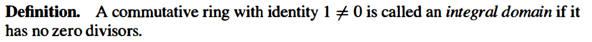

> Proof:
>
> $ab = ac \Rightarrow a(b - c) = 0\Rightarrow a = 0$ or $b - c = 0$. (since a is not a zero divisor, then if $a\neq 0$ and $b-c\neq 0$, then $a(b-c)\neq 0$).

> Proof:
>
> Let $a$ be a nonzero element. By the cancellation law, $\varphi: x \mapsto ax$ is injective. Since $R$ is finite, $\varphi$ is also surjective. Thus $\exists b\in R$ s.t. $ab=1$, so $a$ is a unit in $R$. Hence $R$ is a field.

A remarkable result of Wedderburn is that a finite division ring is necessarily commutative, i.e., is a field.  

That is,

1. $S \neq \varnothing$.
2. $\forall a, b\in S, a-b\in S$ and $ab\in S$.

(子环 $S$ 的 $0$ 是 $R$ 的 $0$， $S$ 的 $1$ 不一定是 $R$ 的 $1$. e.g. $2\mathbb Z/10 \mathbb Z \subseteq \mathbb Z/10\mathbb Z$ has identity $6$, but identity of $\mathbb Z / \mathbb 10\mathbb Z$ is $1$.

Examples:

The *integral* Quaternions, form a subring of either the real or the rational Quaternions.

(it is not directly defined in this way, but comes from other things)

#### 7.2 Examples: Polynomial Rings, Matrix Rings, and Group Rings

##### Polynomial Rings

(the definition of addition and multiplication are still valid if $R$ is not commutative.)

> Proof:
>
> (1)(3) if $p(x)$ and $q(x)$ are polynomials with leading terms $a_nx^n$ and $b_mx^m$, then $p(x)q(x)$ has leading term $a_nb_mx^{n+m}$. Since $a_nb_m\neq 0$, $p(x)q(x)\neq 0$, and it is a polynomial with degree $n+m$.
>
> (2) if $p(x)q(x)=1$, then $n=m=0$ and $a_nb_m=1$, so the units must be in $R$. Hence the units are the units of $R$.

##### Matrix Rings

If $R$ is a nontrivial ring and $n\geq 2$, then $M_n(R)$ is not commutative.

$M_n(R)$ has zero divisors for all nonzero rings $R$ whenever $n \geq 2$ (指的是存在 zero divisor，而不是每个元素都有 zero divisor)

**Scalar matrix**: $A = aI$. (informal notation)

$GL_n(R)$: the **general linear group** of degree $n$ over $R$ (the invertible $n\times n$ matrices)

##### Group Rings

multiplication:
$$
\lp \sum a_ig_i\rp\lp \sum b_jg_j \rp = \sum_{i,j}(a_ib_j)g_ig_j
$$
(Again, commutativity of $R$ is not needed.)

$RG$ is commutative if and only if $G$ is a commutative group.

$G$ is a *subgroup of the group of units of* $RG$.

#### 7.3 Ring Homomorphisms and Quotient Rings

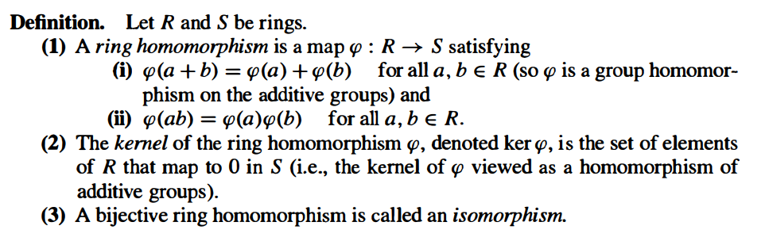

(since $\varphi(b) + \varphi(-b) = \varphi(b+(-b)) = \varphi(0) = 0, \varphi(a-b) = \varphi(a+(-b))= \varphi(a)+\varphi(-b)=\varphi(a)-\varphi(b)$).

> Proof:
>
> (1) $\forall \varphi(a), \varphi(b) \in \varphi(R), \varphi(a) - \varphi(b) = \varphi(a-b) \in \varphi(R), \varphi(a)\varphi(b) = \varphi(ab) \in \varphi(R)$.
>
> (2) $\forall a, b\in \ker \varphi, \varphi(a-b) = \varphi(a) - \varphi(b) = 0$, so $a-b \in \ker \varphi$. $\varphi(ab) = \varphi(a)\varphi(b) = 0$, so $ab\in \ker \varphi$. 
>
> If $\alpha \in \ker \varphi$, then $\varphi(\alpha r) = \varphi(\alpha)\varphi(r) = 0$, so $\alpha r \in \ker \varphi$. Similarly, $r\alpha \in \ker \varphi$.

P241 $XY$ is the fiber over $ab$: 直接用 $(r+I)\times (s+I) = (rs)+I$ 来证. ($sI = I$ by prop 5.)

Let $\varphi : R \to S$ be a homomorphism. Let $I = \ker \varphi$, then we have
$$
\begin{align}
(r+I) + (s+I) &= (r+s)+I\\
(r+I) \times (s+I) &= (rs)+I.
\end{align}
$$

Now, for any $I \leq (R, +)$. Since $(R, +)$ is abelian, the first property holds (because every subgroup is normal). We consider when the second property holds.

If we we want the multiplication in (2) well defined, that the multiplication is independent of the particular representatives $r$ and $s$ chosen. If we use representation $r+\alpha$ and $s + \beta$ instead of $r$ and $s$, we have
$$
(r + \alpha)(s + \beta)+I = rs + I.
$$
for all $r, s\in R$ and $\alpha, \beta \in I$.

First, by letting $s=0$ and $r$ be arbitrary, we have $r\beta\in I$ for every $r \in R$ and $\beta \in I$. Similarly, $\alpha s \in I$.

Conversely, if $r\beta \in I$ and $\alpha s \in I$, then $(r + \alpha)(s + \beta) + I = rs+\alpha s+r\beta + \alpha\beta + I = rs + I$. Hence these are the necessary and sufficient condition.

Finally, if the multiplication property $(2)$ is well defined, then we can verify the quotient follows directly from the axioms of rings. For example, distributive laws is verified as follows:
$$
\begin{align}
(r+I)[(s+I)+ (t+I)]
&= (r+I)[(s+t)+I]\\
&= r(s+t)+I\\
&= (rs + rt) + I\\
&= (rs+I)+ (rt+I)\\
&= [(r+I)(s+I)] + [(r+I)(t+I)].

\end{align}
$$
It shows that the quotient $R/I$ of the ring $R$ by $I$ has a natural ring structure if and only if .... (so it must be a subring of $R$ since it is closed under multiplication.)

Then we define these subsets as ideals:

For commutative rings the notions of left, right and two-sided ideal coincide. 

We emphasize that to prove a subset I of a ring R is an ideal it is necessary to prove that I is nonempty, closed under subtraction and closed under multiplication by all the elements of R (and not just by elements of I). 

If R has a 1 then (-1)a = -a so in this case I is an ideal if it is nonempty, closed under addition and closed under multiplication by all the elements of R.  

 注意这是 additive quotient group，所以元素是 $\overline{r} = r+I$.

> Proof:
>
> The first statement: by the discussion above.
>
> Conversely, by proposition 5, $\forall \alpha\in I, r\in R$, $r\alpha\in I$ and $\alpha r\in I$, so $I$ is an ideal.

$R/I$ 中的 $0$ 为 $0+I=I$, $1$ 为 $1+I$ （如果有的话）.

> Proof:
>
> (1) By the previous discussion, $\varphi(R)$ is a subring of $S$ and $\ker \varphi$ is a substring of $R$.
>
> Since $\forall \alpha \in I, r\in R$, $r\alpha\in I$ and $\alpha r\in I$, $I$ is an ideal of $R$.
>
> Let $\psi: r + I \mapsto \varphi(r)$. Clearly $\psi$ is surjective. Then $\varphi(r) = \varphi(s) \Leftrightarrow \varphi(r-s) = 0 \Leftrightarrow r - s \in I \Leftrightarrow r+I = s+I$, so it is well defined and surjective, hence it is a ring isomorphism.
>
> (2) If $I$ is an ideal, then $R/I$ is a ring and the map $\pi : r \to r +I$ is a group homomorphism with kernel $I$. Then, since
> $$
> \pi(rs) = (rs)+I = (r+I)(s+I) = \pi(r)\pi(s),
> $$
> it is a ring homomorphism.

> Sketch of proof:
>
> For each theorem, (for example, (2)), let $\varphi: R/I \to R/J$ by $r+I \mapsto r+J$ be the corresponding homomorphism. This map is multiplicative since $\varphi((r_1+I)(r_2+I)) = \varphi((r_1r_2)+I = (r_1r_2)+J = (r_1+J)(r_2+J) = \varphi(r_1+J)\varphi(r_2+J)$.

$I+J$ is the smallest ideal containing both $I$ and $J$.

$IJ$ is an ideal contained in $I \cap J$. ($IJ \subseteq I, IJ \subseteq J$.) Note that it may that $I \not \subseteq IJ$ since it is not necessary to have $1\not \in J$. Also, in general, $IJ \neq \{ab \mid a\in I, b\in J\}$.

Example. Let $I = 6\Z$ and $J = 10\Z$, then $I+J = 2\Z$ and $IJ=60\Z \neq 30\Z=I\cap J$.

#### 7.4 Properties of Ideals

**Through out this section $R$ is a ring with identity $1 \neq 0$.**

$RA$ is a left ideal that contains $A$, and if $I$ is the smallest left ideal containing $A$, then $RA\subseteq I$, (here we use $RA$ but not $rA$ because the left idea must be closed under addition), so $RA$ is the smallest left ideal containing $A$. Similarly, $AR$ is the smallest right ideal containing $A$, and $RAR$ is the smallest ideal containing $A$.

Also note that $(a) + (b)$ is the smallest ideal containing $(a)$ and $(b)$, so it is the smallest ideal containing $\{a, b\}$.

When $R$ is commutative, $(a)$ is just the set of all $R$-multiples of $a$.

The ideal $(2, x)$ in $\Z[x]$ is *not* a principle ideal.

> Proof:
>
> (1) If $I$ contains a unit $u$ that $uv=1$, then $\forall r \in R, r = 1r = uvr = u(vr) \in I$.
>
> Conversely, if $I=R$, then $I$ contains the unit $1$.
>
> (2) If $R$ is a field, then every non-zero element is a unit, so if $I\neq\{0\}$, then $I$ contains a unit, so $I = R$. 
>
> Conversely, if the only ideals are $0$ and $R$, let $u$ be any nonzero element in $R$. Then $(u) = R$, so there is some $v$ that $uv=1$, that is, $u$ is a unit. Hence every nonzero element in $R$ is a unit, so $R$ is a field.

> Proof:
>
> If $R$ is a field, then $\ker \varphi \neq R $ since there is some element $u$ that $\varphi(u)\neq 0$. Then $\ker \varphi = 0$ since $\ker \varphi$ is an ideal but $R$ only has two ideals $0$ and $R$. Hence $R$ is injective.

> Proof: omitted.

> Proof:
>
> By the fourth isomorphism theorem, if there is an ideal $M \subset I \subset R$, then $I/M$ is an ideal of $R/M$. However $R/M$ is a field, so has only two ideals $0$ and $R/M$, so either $I=M$ or $I=R$. Thus $M$ is a maximal ideal.
>
> Conversely, if $M$ is a maximal ideal, then $R/M$ has only two ideals $0$ and $R$, then $R/M$ is a field.

> Proof:
>
> Let if $P$ is a prime ideal, then $\forall a, b\in R, ab\in P \Rightarrow$ $a\in P$ or $b \in P$. Then $\overline{a}\overline{b} = \overline{ab}\in \overline{0} \Rightarrow \overline{a} \in \overline{0}$ or $\overline{b} \in \overline{0}$, so there is no zero divisors.
>
> Conversely, if $R/P$ is an integral domain, then $\forall a, b\in R$, is $ab \in P$, then $\overline{a}\overline{b} \in  \overline{0} \Rightarrow \overline{a} = \overline{0}$ or $\overline{b} = \overline{0}$, that is, $a \in P$ or $b \in P$.

> Proof:
>
> It is straightforward that if $I$ is a maximal ideal, than $R/I$ is a field (so it is a integral domain), so $I$ is a prime ideal.

#### 7.5 Rings of Fractions

**Throughout this section $R$ is a commutative ring.**

> Proof:
>
> (1) 
>
> Then $\sim$ is a equivalence relation. Let the equivalence classes be
>
> 
>
> and define $Q$ be the set of equivalence classes, and define addition and multiplication.
>
> At last, we can verify that 
>
> 
>
> Hence $Q$ is a field.
>
> (2)
>
> Extend $\varphi : R \to S$ to $\Phi : Q \to S$ by $\Phi(rd^{-1}) = \varphi(r)\varphi(d)^{-1}$. (we can prove that this map is well defined. and $\Phi$ is a ring homomorphism). Finally, $rd^{-1} \in \ker \Phi \Rightarrow r \in \ker \Phi \cap R = \ker \varphi$. Since $\varphi$ is injective, $\ker \varphi=0$, so $\ker \Phi=0$ and $\Phi$ is injective. 

(another motivation: turn polynomial ring into polynomial field.

> Proof: omitted.

#### 7.6 The Chinese Remainder Theorem

**Throughout this section we shall assume unless otherwise stated that all rings are commutative with an identity $1 \neq 0$.**

> Proof: we prove this theorem by mathematical induction.
>
> If $k=2$, let $A=A_1$ and $B=A_2$.
>
> Define $\varphi: R \to R/A \times R/B$ by $\varphi(r) = (r+A, r+B)$.  We can verify that $\varphi$ is a ring homomorphism.
>
> .
>
> Since $A+B=R$, there are elements $x \in A$ and $y \in B$ that $x+y=1$. Then $\varphi(x) = (0, 1)$ and $\varphi(y) = (1, 0)$ since $x+B = 1-y+B = 1+B$. If $r_1A + r_2 B \in R/A \times R/B$, then we can verify that $\varphi(r_1x+r_2y) = r_1A + r_2B$. This shows that $\varphi$ is surjective.
>
> Finally, if $A=A_1$ and $B=A_2 \cdots A_k$, by hypothesis, $\forall 2 \leq i \leq k, \exists x_i \in A_1, y_i \in A_i$ s.t. $x_i+y_i=1$. Then $1 = (x_2+ y_2) \cdots (x_k+y_k) \in (A_1 + y_2) \cdots (A_1 + y_k) = A + (y_2\cdots y_k) \subseteq A_1 + (A_2 \cdots A_k)$.
>
> (and then the induction part can use the above conclusion).

> Proof:
>
> Coordinates of each unit in $\Z/n\Z$ is a unit in $\Z/ p_1^{\alpha_1}\Z$. (consider the inverse of each element / coordinate).

### Chapter 8 Euclidean Domains, Principal Ideal Domains, and Unique  Factorization Domains

**All rings in this chapter are commutative.**

#### 8.1 Euclidean Domains

The importance of the existence of a Division Algorithm on an integral domain $R$ is that it allows a *Euclidean Algorithm* for two elements $a$ and $b$ of $R$.

The quotient and the remainder are not unique.

这个 norm 并不是 E.D. 的一部分.

Every field is a E.D.

$\Z$ is a E.D.

If $F$ is a field, then $F[x]$ is a E.D. Otherwise not.

$\Z[i]$ is a E.D.

> Proof:
>
> If $I=0$, then there is nothing to prove.
>
> Otherwise, let $d$ be any nonzero element of $I$ of minimum norm. (such a $d$ exists, because we can first choose an element $r\in I$, and continuously checking whether there is an element with norm $<N(r)$ for $N(r)-1$ times.) Clearly $(d) \subseteq I$.
>
> Now for each element $a \in I$, use the division algorithm to obtain $a=qd+r$ with $r=0$ or $N(r) < N(d)$. Since $N(d)$ is the minimum, $r$ must be $0$, so $a=qd \in (d)$, showing $I=(d)$.

Proposition 1 can also be used to prove that some integral domains $R$ are not Euclidean Domains (with respect to any norm) by proving the existence of ideals of $R$ that are not principal.

Note that $(2, x)$ is not principal in $\Z[x]$. (page 252, example (3) of section 7.4)

$(3, 2+\sqrt{-5})$ is not principal in $\Z[-5]$.

.

and

and $(d) = (a, b)$.

> Proof:
>
> by the previous discussion.

>Proof:
>
>It is clear if $d$ or $d^\prime$ is zero. Now we assume both of them are nonzero.
>
>Since $d \in (d^\prime)$, $d=xd^\prime$ for some $x$. Similarly $d^\prime = yd$ for xome $d$. Thus $d = xyd$ and so $d(1-xy) = 0$. Since $d\neq 0, xy=1$, that is, both $xy$ are units. (note that $R$ is commutative.)
>
>The second assertion follows from $(d) = (a, b) = (d^\prime)$.

The converse is obvious: If $(d)=I$, then $(ud) = (d) = I$.

> Proof:
>
> By proposition 1, every ideal is principle and so is $(a, b)$.
>
> Let $d=r_n$, we will show that
>
> 1. $d \mid a$ and $d \mid b$, so $(a, b) \subseteq (d)$.
> 2. $d=ax+by$, so $(a, b) \subseteq (d)$.
>
> For $(1)$, we can observe that every element $r_i$ is a multiple of $r_n$, and so is $a$ and $b$.
>
> For $(2)$, we can use mathematical induction on $i$ to construct $d = r_ix_i + r_{i+1}y_i$.

当 $R$ 只是 P.I.D 而不是 E.D. 时候，只能保证 Theorem 4 也成立，但用不了 Euclidean Algorithm 了.

Proposition 5 omitted.

#### 8.2 Principal Ideal Domains (P.I.D.s)

Proposition 1 proved that every E.D. is a P.I.D.. However, not every P.I.D. is a E.D..

This is just proposition 2 and 3.

> Proof:
>
> Let $(p)$ be a nonzero prime ideal. Let $I = (m)$ be a ideal contatining $(p)$. We will show that $I=(p)$ or $I = R$.
>
> Since $p \in (m)$, $p=rm$ for some $r$. Since $(p)$ is a prime ideal and $rm \in (p)$, either $r\in (p)$ or $m \in (p)$.
>
> If $r \in (p)$, that is, $r=ps$, then $p = rm = psm$, so $sm=1$ which implies $m$ is a unit. Hence $I = (m) = R$.
>
> If $m \in (p)$, then $(m) \subseteq (p)$, so $I = (p)$.
>
> Hence $(p)$ is maximal.

关键之处在于 $p\in (m)$ 能够写成 $p=rm$ 的形式.

> Proof:
>
> Assume $R[x]$ is a P.I.D.. Then $R$ is a integral domain.
>
> The ideal $(x)$ is a nonzero prime ideal in $R[x]$ because $R[x] / (x) \cong R$.
>
> By proposition 7, $(x)$ is a maximal, hence $R$ is a field by proposition 7.4.12.

#### 8.3 Unique Factorization Domains (U.F.D.s)

> Proof:
>
> Suppose $(p)$ is a nonzero prime ideal and $p=ab$. Then $ab= p \in (p)$. Suppose $a = pr \in (p)$. Then $p = ab = prb$, so $rb=1$ and $b$ is a unit. Hence $p$ is irriducible.

> Proof:
>
> By proposition 10, every prime is irriducible, and we only need to prove irriducibles are primes.
>
> If $M = (m)$ is a ideal containing $(p)$, then $p = rm \in (m)$. Since $p$ is irriducible, either $r$ or $m$ is a unit. This means either $(p) = (m)$ or $(m) = (1)$, respectively. Thus $(p)$ is a maximal ideal, and therefore is a prime ideal.

(U.F.D. implies 不仅可以这样分解，而且分解还是唯一的.

> Proof:
>
> By proposition 10, every prime is irriducible.
>
> Conversely, let $p$ be an irriducible in $R$ and assume $p \mid ab$, i.e., $ab = pc$.
>
> Write down the factorizatino of $ab$, since $p$ is irriducible, there must be a factor in $ab$ that is associate to $p$. Suppose $ a = (up)p_2\cdots p_n$, then $p \mid a$, completing the proof.

> Proof: straightforward.

> Proof: omitted.

> Proof:
>
> $\Z$ is a E.D., so 

##### Factorization in the Gaussian Integers  

##### Summary

### Chapter 9 Polynomial Rings

For convenience, the ring $R$ will always be a commutative ring with identity $1 \neq 0$.

#### 9.1 Definitions and Basic Properties

In this way, $R[x]$ is a commutative ring with identity (the identity $1$ from $R$) in which we identify $R$ with the subring of constant polynomials.

> this is proposition 7.2.4

> Proof:
>
> There is a natural map given by reducing each of the coefficients of a polynomial module $I$. It is easy to prove that such map $\varphi$ is a homomorphism.
>
> The kernel is precisely the set of polynomials each of whose coefficients is an element of $I$, which is to say that $\ker \varphi = I[x] = (I)$.
>
> Since $I$ is a prime ideal, then $R/I$ is a integral domain. Hence also $(R/I)[x]$ is an integral domain follows from proposition 1. It shows that $R[x] / (I)$ is an integral domain and $(I)$ is a prime ideal.

($R[x] / (I, x) \cong R / I$, where the right one is a field since $I$ is maximum.

A polynomial is called *homogeneous* or aform if all its terms have the same degree.   

#### 9.2 Polynomial Rings over Fields I

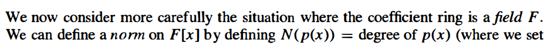

> Proof:
>
> If $a(x)=0$, then we set $q(x) = r(x) = 0$.
>
> Otherwise, let $n=degree~ a(x), m = degree~ b(x)$. We may apply mathematical induction on $n$.
>
> If $n<m$, then we set $q(x) = 0$ and $r(x) = a(x)$.
>
> Otherwise, let $a_1(x) = a(x) - \frac{a_n}{b_m}x^{n-m}b(x)$, then $degree~ a_1(x) < n$. By the inducition hypothesis, $a_1(x) = q_1(x) b(x) + r(x)$. Letting $q(x) = q_1(x) + \frac{a_n}{b_m}x^{n-m}$, we have $a(x) = q(x)b(x) + r(x)$.
>
> For the uniqueness, if $a(x) = q_1(x)b(x) + r_1(x) = q_2(x)b(x) + r_2(x)$, then $q_1(x)b(x) - q_2(x)b(x)$ has degree $<m$ if it is nonzero since $F$ is an integral domain. However it is a multiple of $b(x)$, so it must be zero. Therefore $q_1(x) = q_2(x)$ and $r_1(x) = r_2(x)$.

> Proof: this is immediate from proposition 3.

We note that the quotient and remainder in the Division Algorithm applied to $a (x), b(x) \in F[x]$ are independent offield extensions in the following sense.

(mark: the g.c.d. of two polynomials is unique if we specify it to be monic.

#### 9.3 Polynomial Rings that are Unique Factorization Domains

> Proof:
>
> Let $p(x) = A(x)B(x)$, multiplying both sides by the dominators, we obtain an equation $d p(x) = A_1(x)B_1(x)$ where each polynomial is in $R[x]$. Since $F[x]$ is a U.F.D., we can factorize all polynomials, and divide $A_1(x)$ and $B_1(x)$ by some irreducibles to obtain $p(x) = a(x)b(x)$.
>
> More precisely, if $d = p_1p_2\cdots p_n$, since $p_1$ is irreducible in $R$, $p_1$ is a prime, then by proposition 2, $p_1R[x]$ is prime and $(R/p_1R)[x] \cong R[x]/p_1[x]$ is an integral domain. Then one of the two polynomials, say $A_1(x)$, is a multiple of $p_1$. Hence $\frac{1}{p_1}A_1(x)\in R$ and we can cancel each irreducibles in this way to obtain $p(x) = a(x)b(x)$.

> Proof:
>
> By Gauss' Lemma, if $p(x)$ is reducible in $F[x]$ then it is reducible in $R[x]$.
>
> Conversely, if $p(x) = a(x)b(x)$ in $R[x]$, then neither $a(x)$ nor $b(x)$ are constant polynomials (otherwise, let's say $a$ is constant that is not a unit, then the g.c.d. of the coefficients will not be $1$.), so the same factorization shows that $p(x)$ is reducible in $F[x]$.

> Proof:
>
> If $R[x]$ is a U.F.D., then obviously $R$ is a U.F.D..
>
> Conversely, let $p(x) = dp_1(x)$, where $d$ is the g.c.d. of the coefficients of $p(x)$, then we can uniquely factorizes $d$, so if we can uniquely factorize $p_1(x)$ then we can uniquely factorizes $p(x)$. Thus we may assume the g.c.d. of $p(x)$ is $1$. We may further assume $degree ~p(x)>0$.
>
> Let $F$ be the field of fractions of $F$.
>
> By Gauss's Lemma, $p(x)$ can be factorizes into irreducibles in $F[x]$ and also in $R[x]$. Since the g.c.d. of coefficients of $p(x)$ is $1$, the g.c.d. of coefficients of each factor is also $1$. By Corollary 6, each factor is irriducible in $R[x]$. This shows that $p(x)$ can be factorized as a finite product of irreducibles in $R[x]$.
>
> The uniqueness of the factorization follows from the uniqueness in $F[x]$. If there are two factorization in $F[x]$, say $p(x) = p_1(x) \cdots = q_1(x) \cdots$ where $p_1(x) = \frac{a}{b}q_1(x)$ and all coefficients of each polynomial has g.c.d. $1$. In this case $bp_1(x) = aq_1(x)$, so consider the coefficients (dividing both sides with the g.c.d. of the coefficients), we have $a = ub$ for some unit $u\in R$. Hence $p_1(x)$ and $q_1(x)$ are associate in $R[x]$. This completing the proof.

> Proof: It is straightforward using mathematical induction on the number of variables.

#### 9.4 Irreducibility Criteria

> Proof:
>
> If $p(x)$ has a factor of degree $1$, then since $F$ is a field, we may assume the factor is monic, i.e., is of the form $(x - \alpha)$, so $p(\alpha) = 0$.
>
> Conversely, let $p(x) = q(x)(x-\alpha) + r$. Since $p(\alpha) = 0$, $r$ must be $0$, so $p(x)$ has $(x - \alpha)$ as a factor.

> This follows from proposition 9, since a polynomial of degree two or three is reducible if and only if it has at least one linear factor.

> Proof:
>
> By hypothesis, $p(r/s) = 0 = a_n(r/s)^n + \cdots + a_0$. Multiplying through by $s^n$ obtain $0 = a_nr^n + \cdots + a_0s^n$. Thus $a_nr^n = s(-a_{n-1}r^{n-1} - \cdots - a_0s^{n-1})$, so $s$ divides $a_nr^n$. Since $\gcd(s, r)=1$, it follows that $s \mid a_n$. Similarly, $r \mid a_0$.

> Proof:
>
> If $p(x)= a(x)b(x)$ where $a(x)$ and $b(x)$ are monic, nonconstant polynomials in $R[x]$, then $\overline{p(x)} = \overline{a(x)}~\overline{b(x)}$, so $\overline{p(x)}$ is reducible in $(R/I)[x]$.

(it can also be used in several variables, but some care must be exercised. For example, a non-unit element may be a unit in the quotient.

> Proof:
>
> Suppose $f(x) = a(x)b(x)$, where $a(x), b(x)$ are non constant polynomials.
>
> Reducing this equation modulo $P$, then $x^n = \overline{a(x)} ~\overline{b(x)}$. Since $P$ is a prime ideal, $R/P$ is a integral domain, so both $\overline{a(x)}$ and $\overline{b(x)}$ will have $0$ constant term (otherwise we can find out that the left side will have at least two terms). Hence the constant terms of $a(x)$ and $b(x)$ are elements of $P$, and $a_0$ is an element of $P^2$, a contradiction.

> Proof: $p$ is a prime in $\mathbb Z$, so $f(x)$ is irreducible in $\Z[x]$. By Gauss' Lemma, $f(x)$ is also irreducible in $\mathbb Q[x]$.

#### 9.5 Polynomial Rings over Fields II

> This follows from Proposition 8.2.7 and Proposition 8.3.11 that $F[x]$ is a P.I.D., and $(f(x))$ is a prime ideal.
>
> In particular, $f(x)$ is irreducible $\Leftrightarrow (f(x))$ is prime $\Leftrightarrow (f(x))$ is maximal $\Leftrightarrow$ $F[x]/(f(x))$ is a field.

> Proof:
>
> if $f_i(x)$ and $f_j(x)$ are distinct, then they are coprime and the g.c.d. is $1$. Hence they are comaximal.
>
> Then apply the CRT to get the conclusion.

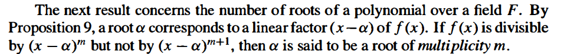

> Proof:
>
> The first statement follows by induction from Proposition 9.
>
> Since each linear factor is irreducible, the second statement follows since $F[x]$ is a U.F.D.. (if it has more roots, then the degree of $f(x)$ will be greater than $n$.)

> Proof:
>
> By the Fundamental Theorem, 
> $$
> G \cong \Z/n_1\Z \times \cdots \Z / n_k \Z.
> $$
> where $n_k \mid n_{k-1} \mid \cdots \mid n_2 \mid n_1$.
>
> In general, if $H$ is a cyclic group and $d \mid \abs{H}$, then $H$ contains precisely $d$ elements of order dividing $d$: $x^{\frac{\abs{H}}{d}}, \ldots, x^{\frac{\abs{H}}{d}(d-1)}$.
>
> Since $n_k \mid n_i$, it follows that each direct factor contains $n_k$ elements of order dividing $n_k$. If $k>1$, then the number of such elements will be more than $n_k$, but then there will be more than $n_k$ roots or the polynomial $x^{n_k}-1=0$ in the field $F$, contradicting Proposition 17.
>
> Hence $k=1$ and the group is cyclic.

> This is the multiplicative group of the finite field $\Z / p\Z$.

> Proof: omitted.

## Part 3 Modules and Vector Spaces

modules are "similar" to rings

### Chapter 10 Introduction to Module Theory

#### 10.1 Basic Definitions and Examples

Modules satisfying axiom 2(d) are called unital modules and in this book all our modules will be
*unital* (this is to avoid "pathologies" such as having $rm = 0$ for all $r \in R$ and $m \in M$).

Modules over a field $F$ and vector spaces (linear spaces) over $F$ are the same.

(The module concept is a generalization of vector space.

Example: $\Z$-modules are the same as abelian groups, and $\Z$-submodules are the same as subgroups.

Example: $F[x]$-modules.

> Proof:
>
> If $N$ is a submodule, then $ry\in N$ and so $x + ry\in N$.
>
> Conversely, taking $r=-1$ shows that $x -y\in N$, so $N$ is a subgroup of $M$.
>
> Taking $x=0$ shows that $ry\in N$, so $N$ is a submodule.

($A$ has a natural left (and right) (unital) $R$-module structure defined by $r \cdot a = f(r)a$. (and we assume the action is this one.

Eg. any ring with identity is a $\Z$-algebra (let $f(n) = 1 + 1 + \cdots + 1)$.

(here $f(r) = r \cdot 1_A$.

#### 10.2 Quotient Modules and Module Homomorphisms

there is a tiny difference between module homomorphism and the ring homomorphism: (1)(b).

also, a $R$-module homomorphism need not to be a ring homomorphism, and vice versa.

$\Z$-module homomorphisms are the same as abelian group homomorphisms.

> Proof:
>
> (1) Take $r=1$ to see that $\varphi(x+y) = \varphi(x) + \varphi(y)$ and $y=0$ to verify that $\varphi(rx) = r\varphi(x)$.
>
> The converse is obvious.
>
> (2) It is straightforward to check.
>
> The commutativity of $R$ is used to verify the second axiom of $R$-module homomorphism, namely
>
> $(r_1\varphi)(r_2m) = r_1\varphi(r_2m) = r_1r_2\varphi(m) = r_2r_1\varphi(m) = r_2(r_1\varphi(m)) = r_2((r_1\varphi)m)$.
>
> (3) it is straightforward to check.
>
> (4) It is straightforward to check.
>
> If $R$ is commutative, then (2) shows that the ring $Hom_R(M, M)$ is an $R$-module.
>
> (Define $\varphi r = r\varphi$, 不需要这个吧？直接按照 $R$-algebra 的定义也可以证明) by exercise 10.1.22, $Hom_R(M, M)$ is an $R$-algebra.

In (2), The domain M could in fact be any set - it does not have to be an R-module nor an abelian group  

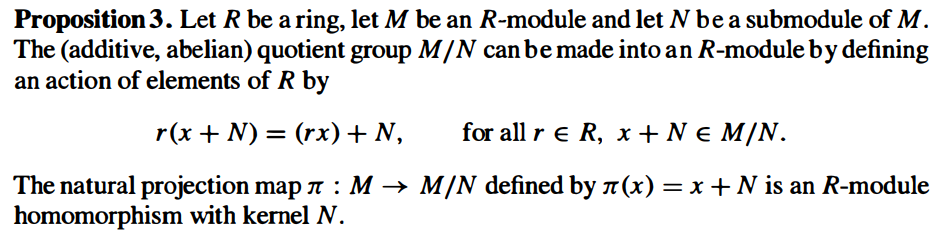

> Proof:
>
> Since $M$ is an abelian group, the quotient group $M/N$ is defined and it is an abelian group.
>
> To see that the action is well defined, suppose $x+N=y+N$, then $(x-y) \in N$. Since $N$ is a (left) $R$-submodule, $r(x-y) \in N$, and thus $(rx)+N = (ry)+N$.
>
> We can check that $M/N$ follows the $R$-module axioms by definition.
>
> The kernel of $\pi$ is, in the same sense as quotient groups, $N$.
>
> It remains only to show $\pi$ is an $R$-module homomorphism. This can be done by verify the axioms. For example,
> $$
> \pi(rm) = rm+N = r(m+N) = r\pi(m).
> $$

All the isomorphism theorems stated for groups also hold for $R$-modules. The proofs are similar to aboves that we can show the group homomorphism are also $R$-module homomorphisms.

One can easily check that the sum oftwo submodules A and B is a submodule and is the smallest submodule which contains both A and B.  

#### 10.3 Generation of Modules, Direct Sums, and Free Modules

Let $R$ be a ring with $1$. As in the preceding sections the term "module" will mean "left module."  

> Proof:
>
> 1 -> 2: 
>
> Suppose for some $j$ that (2) fails to hold, and let $a_j \in N_j \cap (N_1 + \cdots + N_{j-1} + N_{j+1} + N_k)$ with $a_j \neq 0$.
>
> Then $a_j = a_1 + \cdots + a_{j-1} + a_{j+1} + \cdots + a_k$ for some $a_i \in N_i$.
>
> Hence $\pi (a_1, \ldots, a_{j-1}, -a_j, a_{j+1}, \ldots, a_k) = 0$, but the preimage is nonzero, a contradiciton.
>
> .
>
> 2 -> 3:
>
> If $a_1 + \cdots + a_k = b_1 + \cdots + b_k$, for each $1 \leq j \leq k$, $(a_j - b_j) = -(a_1 - b_1 + \cdots + a_{j-1} - b_{j-1} + a_{j+1} - b_{j+1} + \cdots + a_k - b_k) \in N_j \cap (N_1 + \cdots + N_{j-1} + N_{j+1} + \cdots + N_k)$., so $a_j - b_j=0$. Hence the representation is unique.
>
> .
>
> 3 -> 1: straightforward.
>
> 

## Part 4 Field Theory and Galois Theory

### Chapter 13 Field Theory

#### 13.1 Basic Properties of Field Extensions

This notation makes sense also for any integral domain (and its characteristic will be the same as for its field of fractions).

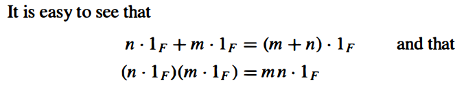

Hence, if $n = ab$ is composite with $n \cdot 1_F = 0$, then $ab \cdot 1_F = (a \cdot 1_F)(b \cdot 1_F) = 0$. Since there is no zero divisor, one of $a\cdot 1_F$ or $b\cdot 1_F$ is $0$, so the smallest such integer is necessarily a prime. It also follows that if $n \cdot 1_F= 0$, then $n$ is divisible by $p$.

> Proof:
>
> The first statement is from the above discussion.
>
> For the second statement, $p \cdot \alpha = p \cdot(1_F \alpha) = (p \cdot 1_F)\alpha = 0$.

Examples:

- $ch(\Q) = ch(\R) = ch(\Z) = 0$.
- $ch(\mathbb {F}_p) = p$.
- 

(field generated by a subset: addition, substraction, multiplication and division.

Examples:

（是把整个 $K$ 当成一个 vector space 而不是商群！！！

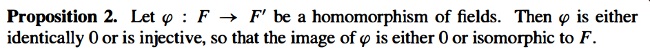

> This is Corollary 10 of Chapter 7.

> Proof:
>
> Consider the quotient
> $$
> K = F[x]/(p(x))
> $$
> of the polynomial ring $F[x]$ by the ideal generated by p(x). Since $p(x)$ is irreducible in the P.I.D. $F[x]$, $K$ is maximal and hence is a field.
>
> Taking the canonical projection $\pi$ of $F[x]$ to the quotient $F[x]/(p(x))$ restricted to $F \subset F[x]$ gives a homomorphism $\varphi = \pi_F : F \to K$ which is not identically $0$ since $\varphi(1) = \pi(1) = 1$. Hence by the proposition above, $\varphi(F) \cong F$  is an isomorphic copy of $F$ contained in $K$.
>
> Then
> $$
> p(\pi(x)) = \pi(p(x)) = p(x) \bmod p(x) = 0,
> $$
> so $K$ contains a root of $p(x)$, completing the proof.

If $F = \R, p(x) = x^2+1$, then $K = \R[x] / (x^2+1) \cong \C$, where the root of $p(x)$ is $\pi(x) \mapsto i$.

> Proof: For any $a(x) \in F[x]$, let $a(x) = q(x)p(x) + r(x)$, so $a(x) \equiv r(x) \pmod {p(x)}$. Hence every polynomial in $F[x]$ is represented by a polynomial of degree less than $n$. Hence the images $1, \theta, \ldots, \theta^{n-1}$ of $1, x, \ldots, x^{n-1}$ span the quotient as a vector space over $F$.
>
> To see this elements are linearly independent, suppose $\sum_{i=0}^{n-1}b_i\theta^i = 0$. Then in $F[x]$, $p(x)$ divides $\sum_{i=0}^{n-1}b_i\theta^i$. However the right part has degree less than $n$, so it is impossible (for not all $b_i=0$.
>
> Hence $[K : F] = n$ by definition.

Note that $p(x)$ should be irreducible. (important!!!

By the results above, all polynomials $q(x)$ of degree $<n$ can divide by nonzero elements as well using the Euclidean Algorithm (i.e., multiply their inverses module p(x)), since $p(x)$ is invertible, so $\gcd(p(x), q(x)) = 1$. (e.g. 计应数 HW8 Problem 2(3).)

$F(\alpha)$ 应该是 $\sum_i a_i\alpha^i$ 了.

> Proof:
>
> In the case of $p(x)$ has degree $1$, it is obviously true, since both sides are $F$.
>
> Otherwise:
>
> There is a natural homomorphism $\varphi: F[x] \to F(\alpha)$ by $\varphi(a(x)) = a(\alpha)$ (by mapping $F$ to $F$ and $x$ to $\alpha$ then extend it.)
>
> Since $p(\alpha)$ = 0, $(p(x)) \subseteq \ker \varphi$, so we can construct another mapping $\psi: F[x] / (p(x)) \to F(\alpha)$ induced by the previous one.
>
> (it is easy to verify that $\psi$ is well defined: $\psi(a(x) + q(x)p(x)) = \psi(a(x))$.
>
> Since $p(x)$ is irreducible (so $F[x] / (p(x))$ is a field), and $\psi$ is not identically zero, so $\ker \psi = \{0\}$ and $\psi$ is injective. Also $\psi(x) = \alpha $ and $\psi(F) = F$ are in the image of $\psi$, so $\psi$ is surjective.
>
> Hence $\psi$ is an isomorphism.

（那如果两个不同的 $p_1(x)$和 $p_2(x)$ 有同一个根 $\alpha$ 呢？这里是先扩展出 $K$ 再选 $\alpha$ 的，前面这种情况会认为是不同的根.

（以及方程的另一个根可能不在 $F(\alpha)$ 内？好像也没有另一个根这一说。。。根的个数都是不知道的。。。

（例如，方程 $x^3-2=0$ 在 $\Q$ 内没有解，在 $\R$ 内有一个解，在 $\C$ 内有三个解. 但它们的 $F(\alpha)$ 都同构于 $\Q[x] / (x^3-2)$.

但本质上这三个解无法区分，只是我们人为地去把它们区分开了. （换句话说，是我们先用某种方式定义了 $\R$，再用 $\R$ 去构造一个解，表现为第一个解.

Different roots of the same irreducible polynomial have the same algebraic properties  

> Proof: conbine Theorem 6 and Corollary 5.

> Proof:
>
> It is straightforward (to verify axioms and use propositions) to find out that
> $$
> F(\alpha) \cong F[x] / (p(x)) \cong F^\prime[x] / (p^\prime(x)) \cong F^\prime(\beta).
> $$

#### 13.2 Algecraic Extensions

Let $F$ be a field and let $K$ be an extension of $F$. (remind that $F \subseteq K$).  

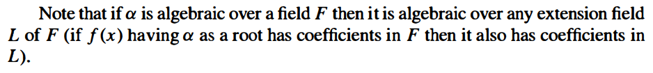

> Proof:
>
> Let $g(x) \in F[x]$ be a polynomial of minimal degree having $\alpha$ as a root. We may suppose $g(x)$ is monic.
>
> Suppose $g(x) = a(x)b(x)$ is reducible, then since $g(\alpha) = a(\alpha)b(\alpha) = 0$, one of $a(\alpha)$ or $b(\alpha)$ is $0$, contradict to $g(x)$ is of minimial degree. Thus $g(x)$ is irreducible.
>
> If $f(x)$ is another polynomial having $\alpha$ as a root, by the Euclidean algorithm, $f(x) = q(x)g(x) + r(x)$, so $f(\alpha) = q(\alpha)g(\alpha) + r(\alpha) = 0$, which implies $r(\alpha)= 0$. Since $g(x)$ is of minimial degree, $r(x)$ must be $0$, so $g(x) \mid f(x)$.
>
> Letting $m_{\alpha, F} = g(x)$ completes the proof.

为什么 $g(x)$ 一定存在呢？（因为 $\alpha$ is algebraic. Then by definition....

另外我们也可以证明 different monic irreducible polynomials have no common roots：如果有相同的 root $\alpha$，那么这两个多项式都是 $\alpha$ 的最小多项式，矛盾.

> Proof:
>
> $m_{\alpha, F}(\alpha) = 0$ in $L$, so by Proposition 9, $m_{\alpha, L}(x) \mid m_{\alpha, F}(x)$.
>
> However, $m_{\alpha, L}(\alpha)$ may not equal to $0$.

E.g. $F = \Q, L = \R, \alpha = \sqrt{2}, m_{\alpha, F} = x^2 - 2, m_{\alpha, L} = x - \sqrt{2}$, so $(x - \sqrt{2}) \mid (x^2 - 2)$.

> Proof:
>
> This follows immediately from theorem 6.

为什么只有 $p(x) = m_\alpha(x)$ 的情况下刚好能除出来 $F(\alpha)$？如果更大的话，$m_\alpha(x) \mid p(x)$，$p(x)$ 就不是 irreducible 的了.

> Proof:
>
> If $\alpha$ is algebraic over $F$, then the extension $F(\alpha) \cong F[x] / (m_\alpha(x))$ has degree deg $m_\alpha(x)$ which is finite.
>
> Conversely, suppose $\alpha$ is an element of an extension of degree $n$ over $F$, then the $n+1$ elements $1, \alpha, \ldots, \alpha^{n}$ are linearly dependent over $F$. Hence $\alpha$ is the root of some equation $b_0 + b_1x + \cdots + b_nx^n = 0$ with $b_i \in F$.
>
> The following two statements are obvious.

> Proof:
>
> For $\alpha \in K$, $F(\alpha)$ is a subfield of $K$, so it is finite. By Proposition 12, $\alpha$ is algebraic. Hence $K$ is algebraic.

The converse is not true (see below).

example: quadratic extensions

> Proof:
>
> If $\alpha_1, \ldots, \alpha_m$ is a basis for $L$ over $K$ and $\beta_1, \ldots, \beta_n$ is a basis for $K$ over $F$, then for each element $l\in L$, $l = \sum_{i=1}^m a_i\alpha_i =  \sum_{i=1}^m(\sum_{j=1}^nb_j\beta_j)\alpha_i$. Hence $\{\alpha_i\beta_j\}$ spans $L$ over $F$.
>
> Next, for $l=0$, $a_i$ must be $0$ since $\{\alpha_i\}$ is a basis, ans similarly $b_j$ must be $0$ for all $i$ and $j$.

> Proof:
>
> This is immediate from Theorem 14.

Example: taking $F = \Q, K = \Q(\sqrt{2}), L=  \Q(\sqrt[6]{2})$, then $[L:F] = 6, [L:K] = 2, [K : F]=3$. Note that the minimal polynomial for $\sqrt[6]{2}$ in $L / K$ is $x^3 - \sqrt{2}$, so it is dependent on $K$ (in the same way? as the number of cosets)

> Proof:
>
> The field $F(\alpha, \beta)$ contains $F, \alpha$, so it contains $F(\alpha)$. Also it contains $\beta$, so it contains $(F(\alpha))(\beta)$.
>
> Since $(F(\alpha))(\beta)$ contains $F, \alpha, \beta$, so it contains $F(\alpha, \beta)$.
>
> Hence $F(\alpha, \beta) = (F(\alpha))(\beta)$.

By this lemma, we can generated the field $F(\alpha_1, \ldots)$ recursively.

> Proof:
>
> If $K/F$ is finite, let $\alpha_1, \ldots, \alpha_k$ be a basis for $K$. Then $K$ is generated by $\alpha_1, \ldots ,\alpha_k$.
>
> Conversely, $[F(\alpha_1, \ldots, \alpha_{i+1}) : F(\alpha_1, \ldots, \alpha_{i})] = [(F(\alpha_1, \ldots, \alpha_i))(\alpha_{i+1}):F(\alpha_1, \ldots, \alpha_{i})] \leq [F(\alpha_{i+1}) : F]$, so $[F(\alpha_1, \ldots, \alpha_k) : F] \leq n_1n_2\cdots n_k$.

> Proof:
>
> All the elements are in the extension $F(\alpha, \beta)$, which is finite by Theorem 17, so by Corollary $13$, they are all algebraic.

> Proof:
>
> This is immediately from Corollary 18.

> Proof:
>
> Let $\alpha$ be any element over $L$. Then $\sum_{i=0}^n a_i\alpha^i=0$ for some $a_i\in K$.
>
> Consider
> $$
> [F(\alpha, a_0, \ldots, a_n):F] = [F(\alpha, a_0, \ldots, a_n):F(a_0, \ldots, a_n)][F(a_0, \ldots, a_n):F].
> $$
> First first term is at most $n$ since $\alpha$ is algebraic over $F(a_0, \ldots, a_n)$, since the minimal polynomial of $\alpha$ is a divisor of the polynomial above, and $[F(\alpha, a_0, \ldots, a_n): F(a_0, \ldots, a_n)] = \deg(m_\alpha(x))$ by corollary 7.
>
> For the second term, $a_i$ is algebraic over $F$, so $a_i$ has finite degree. By Theorem 17, $[F(a_0, \ldots, a_n):F]\leq $ the product of degrees of $a_i$'s is also finite.
>
> Hence $F(\alpha, a_0, \ldots, a_n)/F$ is finite, so $\alpha$ has finite degree. Therefore $\alpha$ is algebraic over $F$.
>
> Hence $L$ is algebraic over $F$.

> Proof:
>
>  $\{\alpha_i\beta_j\}$ 能够 generates 所有 $K_1$ 中的元素（考虑 $1$ 怎么用 $K_2$ 中的元素表示出来的，再乘上这个元素在 $K_1$ 中的表示）和 $K_2$ 中的元素，并且这个集合 generates 出的元素对乘法和加法封闭. 所以就能够 generate 所有元素.
>
> From $K_1K_2 = F(\alpha_1, \ldots, \alpha_n, \beta_1, \ldots, \beta_m) = K_1(\beta_1, \ldots, \beta_m)$ we see that $\beta_1, \ldots, \beta_m$ spans $K_1K_2$ over $K_1$. Hence $[K_1K_2:K_1] \leq m = [K_2 : F]$ with equality if these elements are linearly independent over $K_1$.
>
> Then $[K_1K_2 : F] = [K_1K_2:K_1][K_1:F]\leq nm$.

> Proof:
>
> Since $K_1$ and $K_2$ are subfields of $K_1K_2$, $[K_1K_2:F]$ is divisible by both $n, m$, so it is divisible by $lcm(n,m) = nm$. By proposition 11, $[K_1K_2 : F] \leq nm$, so it is equal to $nm$.

#### 13.4 Splitting Fields and Algebraic Closures

> Proof:
>
> 考虑对 $n=deg ~f$   归纳：每次选择一个 degree >=2 的 irreducible factor $g(x)$，扩充出一个域 $E/F$ 使其包含 $g(x)$ 的一个 root $\alpha$. 不断重复该过程.

书上说最后要取所有 $E$ 中包含 $F$ 和所有 $\alpha_i$ 的子域的交，有这个必要吗？

这个的意思是说对于一个多项式 $f(x)$ 的 splitting field.

这个是指一些多项式的 splitting field.

为什么要强调 aigebraic extension？

这个条件等价于

> Proof:
>
> 
>
> $K(\alpha)$ 是 $f(x)$ over $F(\alpha)$ 的 splitting field：如果 $f(x)$ 在 $K(\alpha)$ 的一个 contains $F(\alpha)$ 的 proper subfield $H$ 中也能 splits，那么 $f(x)$ 在 $K - H$ 中也会有至少一个根（否则会在 $K \cap H$ 中 splits，与 $K$ 是 over $F$ 的 splitting field 矛盾）， 加上 $H$ 中的 $n$ 个根就有 $>n$ 个根了，与 $n$ 次多项式最多有 $n$ 个根矛盾.（这个性质好像经常用得到）
>
> $K(\beta)$ 类似.
>
> 
>
> 

> Proof:
>
> 每次把一个 root $a_i$ 加进来，degree 最多会变大 $deg~f_i$. 并且加入一个 root 之后 $f$ 的度会变小. 乘起来就 $\leq n(n-1)\cdots 1 = n!$.

> Proof:
>
> 每次选出一个 degree $\geq 2$ 的 irreducible polynomial，以及它的一个 root $\alpha$，然后把 $F$ 扩展成 $F(\alpha)$ 并把 $F^\prime$ 扩展成 $F^\prime(\beta)$（$\beta$ 为这个 polynomial 对应到 $F^\prime$ 后的一个 root）.
>
> 然后令 $f_1(x) = f(x) / (x - \alpha) \in F(\alpha)[x]$，$f_1^\prime$ 也类似.
>
> Then apply the induction hypothesis 就能得到一个 $E \cong E^\prime$ 和对应的 $\sigma$.
>
> 并且，$f_1(x)$ 的各个 roots 都是 $f(x)$ 的 roots，所以会在 $E$ 当中. 如果有 $E$ 的 proper subfield $K$ 包含了 $F(\alpha)$ 和 $f_1(x)$ 的所有 roots，那么 $K$ 也会包含所有 $f(x)$ 的 roots，与 $E$ 是最小的满足要求的 field 矛盾.
>
> 

$\varphi$ 只 apply to coefficients.

每个 $\overline{F}$ 里的元素都是某个多项式 $f(x) \in F[x]$ 的根，且每个多项式 $f(x) \in F[x]$ 的根都在 $\overline{F}$ 当中。

 $\overline{F}$ 也是最小的、满足每个 $f(x) \in F[x]$ splits 的域：如果 $K \supset \overline{F}$ 也满足这两点，那么令 $g\in K - \overline{F}$，$g$ 的 minimal polynomial $m_{g, F}$ 就不在 $\overline{F}$ 中 split，矛盾. Convserse is also true: 如果 $K$ 是 $F$ 的 algebraic closure，那么 $K$ 和 $\overline{F}$ 都是最小的、满足每个 $f(x) \in F[x]$ splits 的域，所以它们相等. （如果只是同构而不相等，那么 either 它们的交也满足 $f(x)$ splits，与 $K$ 最小矛盾，or 它们的交不包含某个 $f(x)$ 的所有根，那么 $K-K\cap \overline{F}$ 和 $\overline{F} - K \cap \overline{F}$ 都会有一些根，与 $f(x)$ 最多有 $n$ 个根矛盾.

$\overline{F}$ 也是最大的、$F$ 的 algebraic extension：对于一个 $F$ 的 algebraic extension $L$，那么 $L$ 中每个元素 $\alpha$ 的 minimal polynomial 的所有根都在 $K$ 中（也包含 $\alpha$），所以 $L \subseteq K$. Converse 和上面的类似：注意两个 algebraic extension 的并仍然"是" algebraic extension （即使它不是 field）.

对于一个 $f(x)$，可以每次除掉 $f(x)$ 的一个 root $\alpha$ 的 linear factor $(x-\alpha)$，所以 $f(x)$ 就能 split 了.

并且 $K$ is algebraically closed 当且仅当 $K=\overline{K}$.

> Proof:
>
> Let $f(x)$ be a polynomial in $\overline{F}[x]$ and let $\alpha$ be a root of $f(x)$.  Then $\alpha$ generates $\overline{F}(\alpha)$ which is algebraic over $\overline{F}$, and $\overline{F}$ is algebraic over $\alpha$, so $\alpha$ is algebraic over $\alpha$ by theorem 20. Then $\alpha$ is a root of its minimal polynomial $m_{\alpha, F}(x)\in F[x]$, so its root $\alpha$ is in $\overline{F}$. Hence $\overline{F}$ is algebraically closed.

> Proof: omitted.

> Proof:
>
> by definition, $\overline{F}$ is an algebraic extension over $F$.
>
> Every $f(x) \in F[x]$ splits over $K$, and each root $\alpha$ is algebraic over $F$, so $\overline{F}$ contains all the roots.

> Proof: omitted.

> Proof: directly by proposition 31.

#### 13.5 Separable and Inseparable Extensions

> Proof:
>
> If $f(x) = (x - a)^ng(x)$ with $n \geq 2$, then $D_xf(x) = n(x-a)^{n-1}g(x) + (x-a)^nD_xg(x)$, which is a multiple of $x-a$, so $a$ is a root of $D_xf(x)$.
>
> Conversely, if $a$ is a root of $f(x)$, write $f(x) = (x-a)h(x)$. Then $D_x f(x) = h(x) + (x-a)D_xh(x)$. Substituting $x=a$ yields $h(a)=0$, so $h(x) = (x-a)h_1(x)$ and $f(x)$ has a multiple root $a$.
>
> The equivalence with divisibility by the minimal polynomial for a follows from Proposition 9: if $a$ is a root of a polynomial $g(x)$, then $m_a(x) \mid g(x)$.
>
> The last statement is then clear (let $a$ denote any root of a common factor of $f(x)$ and $D_xf(x)$).  

> Proof:
>
> For any irreducible $p(x)\in F[x]$ of degree $n$, the derivative $D_xp(x)$ is of degree $n-1$. However $p(x)$ only has factors $1$ and $p(x)$, so $(p(x), D_xp(x))=1$. Hence $p(x)$ is separable.
>
> The second statement follows from proposition 9 that different irreducible polynomials do not have zeros in common.

The proof fails if $F$ has characteristic $p$ that $D_xp(x)$ may be $0$. In this case, every term in $p(x)$ must be the form $a_ix^{pi}$, so $p(x) = q(x^p)$ for some $q$. (\*\*)

> Proof:
>
> The first statement follows from the Binomial Theorem.
>
> The second statement is trivial (follows from the associativity).
>
> Also, since $F$ is a field, then any homomorphism (including $\varphi$) should be identically zero (obviously not) or injective.

> Proof: The Frobenius endomorphism is injective and the domain equals codomain, so it is surjective.

> Proof:
>
> If $p(x)$ is irreducible but inseparable, by discussion after corollary 34, $p(x) = q(x^p)$ for some $q(x)$.
>
> Also $a_i = b_i^p$ for some $b_i$. Then
> $$
> \begin{align}
> p(x) &= q(x^p)\\
> &= a_m(x^p)^m + \cdots + a_1x^p + a_0\\
> &= b_m^p(x^p)^m + \cdots + b_1^mx^p + b_0^m\\
> &= (b_mx^m + \cdots + b_1x + b_0)^p,
> \end{align}
> $$
> which contradicts to $p(x)$ is irreducible.
>
> Hence $p(x)$ is separable.
>
> The second statement is similar to corollary 34.

The important part of the proof is the fact that every element in the characteristic $p$ field $\mathbb F$ is a $p^{th}$ power in $\mathbb F$. This suggest the following definition:

With this definition, we see that we have proved that every irreducible polynomial over a perfect field is separable.   

> Proof:
>
> Finite extension $K/F$ => $K$ is algebraic => minimal polynomial of any $a\in K$ is irreducible => minimal polynomial is separable since $F$ is perfect.

此外，algebraic extension of a perfect field is also separable.

#### 13.6 Cyclotomic Polynomials and Extensions

> Proof:
>
> It is clear that $\Phi_n(x)$ is monic and has degree $\varphi(n)$.
>
> To shows that $\Phi_n(x)\in \Z[x]$, we want to use mathematical induction. 
>
> Let $x^n - 1= f(x)\Phi_n(x)$, where $f(x) = \prod_{d \mid n, d < n}\Phi_d(x)$. By Euclidean algorithm, $\Phi_n(x) = (x^n - 1) \bmod f(x)$ which lies in $\Q[x]$ since both $x^n-1$ and $f(x)$ are in $\Z[x]$ and $\Z[x]$ is an E.d..
>
> Then by Gauss' Lemma, $\Phi_n(x) \in \Z[x]$.

> Proof:
>
> By Theorem 41, $\Phi_n(x)$ is the minimal polynomial for any $n^{th}$ root of unity $\xi_n$.

### Chapter 14 Galois Theory

#### 14.1 Basic Definitions

Let $K$ be a field.

note that  $\sigma$ fix $F$ is not equivalent to $\sigma(F) = F$.

note that any field has at least one automorphism -- the identity map $1$.

$\sigma(a) = \sigma(1a) = \sigma(1)\sigma(a)$, so $\sigma(1) = 1$. Similar for $\sigma(0)=0$.

Note that if $F$ is the prime subfield of $K$ then $\aut(K) = \aut(K/F)$, since every automorphism of $K$ automatically fixes $F$.

> Proof:
>
> it is clear that $\aut(K)$ is a group.
>
> If $\sigma, \tau$ fix $F$, then also $\sigma\tau, \sigma^{-1}$ fix $F$, so $\aut(K/F) \leq \aut(K)$.

> Proof:
>
> Suppose $\alpha$ satisfies the equation
> $$
> \begin{align}
> \alpha^n+a_{n-1}\alpha^{n-1}+\cdots+a_1\alpha+a_0&=0\\
> \sigma(\alpha^n+a_{n-1}\alpha^{n-1}+\cdots+a_1\alpha+a_0)&= \sigma(0)=0\\
> (\sigma\alpha)^n + \sigma(a_{n-1})(\sigma a)^{n-1} + \cdots + \sigma(a_1)(\sigma a) + \sigma(a_0) &= 0\\
> (\sigma\alpha)^n + a_{n-1}(\sigma a)^{n-1} + \cdots + a_1(\sigma a) + \sigma(a_0) &= 0\\
> \end{align}
> $$
> so $\sigma a$ is also a root.

**The above proposition is extremely useful for determining the automorphisms of algebraic extensions**  

Examples:

- $\aut(\Q(\sqrt{2})) = \{1, \sigma\}$.
- $\aut(\Q(\sqrt[3]{2})) = \{1\}$.

Field extension $\Leftrightarrow$ a group.

$\Rightarrow$: $\aut(K/F)$.

$\Leftarrow$: fixed field.

> Proof:
>
> It is easy to verify that $F$ is closed.

it is not important that $H$ actually be a subgroup of $\aut(K)$. It is also true when $H$ is just a subset.

> Proof:
>
> (1) if $h \in \aut(K/F_2)$, then $h$ also fixes $F_1$. Hence $\aut(K/F_2) \leq \aut(K/F_1)$.
>
> (2) if $x\in F_2, h\in H_1$, then $h$ also fixes $x$ since $x\in F_1$. Hence $F_2 \subseteq F_1$.

> Proof:
>
> We first prove for arbitrary $F, \varphi, E, F^\prime, E^\prime$:
>
> 
>
> Let $p(x)$ be a irreducible factor of $f(x)$, $\alpha$ be a root of $p(x)$.
>
> Here $\beta = \tau \alpha$, so the number of extensions of $\varphi$ to $\tau$ is equal to the number of different roots $\beta$ of $p^\prime(x)$, since $\alpha$ and $\beta$ and their powers are the generators.
>
> Hence the number of exte	nsions is at most $deg ~p(x) = [F(\alpha) : F]$,  with equality if the roots of $p(x)$ are distinct.
>
> .
>
> Then we can use mathematical induction to prove that the number of extensions is at most $[E : F]$, with equality if all the roots of $f(x)$ are distinct (since different irreducible factors have different roots).
>
> .
>
> In the particular case, let $F=F^\prime$ and $\varphi=1$ and $E = E^\prime$, so the number of automorphisms $\aut(E/F)$ is the number of extensions of $\varphi$.

Galois 本质上是个啥？之后可能会讲到吧。。。

注意 $K/F$ 要 finite.

(so $\aut(K/F)$ is a finite group)

> Proof:
>
> That is just a restatement.

Note also that the splitting field of any polynomial over $\Q$ is Galois, since the splitting field of $f(x)$ is clearly the same as the splitting field of the product of the irreducible factors of $f(x)$ (i.e., the polynomial obtained by removing multiple factors), which is separable (Corollary 13.34).  This is also true for any finite field $\mathbb F_p$.

example: 

- $Gal(E/F)$  is a subgroup of $S_{deg~f(x)}$ since it acts as permutations of the roots of $f(x)$, and the roots are the generators of the splitting field.
- Galois extension of a Galois extension is not necessarily Galois.
- . $Gal(\mathbb F_{p^n} / \mathbb F_p) \cong Z_n$, with the Frobenius automorphism $\sigma_p:\alpha \mapsto \alpha^p$ as generator. （考虑 $x\in \mathbb F_p$, 则 $x^p = x$. )（需要注意 $\mathbb F_{p^n}$ 并不是 $\{0, 1, \ldots, 8\}$ 这样的 $\Z_{p^n}$.
- 

**notes**: Exercise: the isomorphism is unique determined by the action on the generators of the extension.

Hence we can find the elements that are not only roots of irreducible polynomials, but also generators. By proposition $2$, we must map these elements to other roots.

See more on the example of the splitting field of $x^8-2$: the extension is generated by $\theta = \sqrt[8]{2}$ and $i$, where $\theta$ is the root of $x^8-2$ and $i$ is the root of $x^2+1$, so we must map $\theta$ to $\theta\xi_8^j$ and $i$ to $\pm i$ that are the other roots of these polynomials and this uniquely determines the isomorphism. (note that some combination may be illegal.)

#### 14.2 The Fundamental Theorem of Galois Theory

> proof:
>
> Assume they are linearly dependent, and $m$ is the smallest integer possible:
> $$
> a_1\chi_1+ \cdots + a_m\chi_m = 0.
> $$
> Let $g$ be an element that $\chi_1(g_0) \neq \chi_m(g_0)$, then
> $$
> \begin{align}
> a_1\chi_1(g_0g) + \cdots + a_m\chi_m(g_0g) &= 0\\
> a_1\chi_1(g_0)\chi_1(g) + \cdots + a_m\chi_m(g_0)\chi_m(g)&= 0\\
> \end{align}
> $$
> and
> $$
> a_1\chi_m(g_0)\chi_1(g) + \cdots + a_m\chi_m(g_0)\chi_m(g) = 0.
> $$
> _Substracting the above two equations,
> $$
> (\chi_1(g_0) - \chi_m(g_0))a_1\chi_1(g) + \cdots + = 0,
> $$
> with not all zero coefficients, contradicts $m$ is the smallest integer possible. Hence they are linearly independent.

> Proof: omitted.

> Proof:
>
> Let $F_1$ be the fixed field of $\aut(K/F)$, so $F \subseteq F_1 \subseteq K$.
>
> Then by theorem 9, $[K : F] = [K : F_1][F_1 : F] = \abs{\aut(K/F)}[F_1 : F] \geq \abs{\aut(K/F)}$, with equality if and only $F$ is the fixed field of $\aut(K/F)$.

> Proof:
>
> By definition, $G \leq \aut(K / F)$.
>
> By theorem 9, $\abs{G} = [K : F]$ and then by corollary 10,
> $$
> [K : F] = \abs{G} \leq \abs{\aut(K / F)} \leq [K : F],
> $$
> so we must have equality and $\aut(K / F) = G = [K : F]$ and $K/F$ is Galois.

> Proof:
>
> If the fixed fields are the same, then by corollary 11, $G_1$ and $G_2$ must be the same ($=\aut(K/F_1)$), a contradiction.

> Proof:
>
> Proposition 5 proves that the splitting field of a separable polynomial is Galois.
>
> .
>
> Conversely, we first shows that if $K/F$ is Galois then every irreducible polynomial $p(x)$ in $F[x]$ having a root in $K$ splits completely in $K$.
>
> Let $G = \gal(K/F)$, $\alpha \in K$ be a root of $p(x)$.
>
> Let $\alpha, \alpha_2, \ldots, \alpha_r$ be the different elements of $\{\sigma \alpha \mid \sigma \in G\}$, so they are roots of $p(x)$.
>
> Consider the polynomial $f(x) = \prod_{i=1}^r (x - \alpha_i)$.
>
> Since each $\sigma \in G$ permutates the factors to different (because it is an isomorphism) factors of $f(x)$, it keeps $f(x)$ unchanged, so the coefficients of $f(x)$ lie in the fixed field of $G$, which is $F$ by corollary 10. Since $p(x)$ is irreducible, it is the minimal polynomial of $\alpha$, so $p(x) \mid f(x)$.
>
> Besides, since all $\alpha_i$ are roots of $p(x)$, $f(x) \mid p(x)$.
>
> Hence $f(x) = p(x)$ and all roots of $p(x)$ are in $K$.
>
> .
>
> Finally, let $\omega_1, \ldots, \omega_n$ be a basis of $K/F$. For all $i$, let $p_i(x)$ be the minimal polynomial of $\omega_i$. Consider the polynomial $g(x) = \prod_{i=1}^m p_i(x)$ where $p_1, \ldots, p_m$ are all the different polynomials. All roots of $g(x)$ is the roots of $p_i(x)$, and they lie in $K$ by the assumption that if a root lies in $K$, then all roots lie in $K$.
>
> Also $\omega_1, \ldots \omega_n$ are the basis, so the splitting field contains the basis, i.e., it also contains $K$.
>
> Hence $K$ is the splitting field of some separable polynomial $g(x)$.

> Proof: omitted.

 这一类题的时候可以把上面这几个图画出来，会好观察很多.

#### 14.3 Finite Fields

> proof:
>
> The only finite field (unique up to isomorphism) is the field of order $p^n$ by $\mathbb F_{p^n}$.
>
> We have seen that $\gal(\mathbb F_{p^n} / \mathbb F_{p}) \cong Z_n$.
>
> It has a unique subfield of order $p^d$ for $d \mid n$, since the Galois group has a unique subgroup of order $d$. By the fundamental theorem, there is a one to one correspondence between them.

The degree of $\mathbb F_{p^n} / \mathbb F_p$ is $n$.

> Proof:
>
> For $p=2$, $x^4 + 1 = (x+1)^4$.
>
> For odd prime $p$, $8 \mid (p^2 - 1)$, so $x^4+1 \mid x^8-1 \mid x^{p^2-1} - 1 \mid x^{p^2} - x$.
>
> Since the roots of $x^{p^2} - x$ are in the field $\mathbb F_{p^2} / \mathbb F_p$ of degree $2$, any root of $x^4+1$ is at most of degree $2$ over $\F$, so $x^4+1$ cannot be irreducible (otherwise the degree of a root = the degree of minimal polynomial = 4).

> Proof:
>
> By proposition 9.18, the multiplicative group $\F_{p^n}$ is cyclic (of order $p^n - 1$) . Let $\theta$ be a generator, then the powers of $\theta$ enumerates all the elements except $0$, so $\F_{p^n} = \F_p(\theta)$. Also, since the extension is of degree $n$, the minimal polynomial of $\theta$ is of degree $n$ over $\F_p$.

> Proof:
>
> Each root of $x^{p^n} - x$ generates a subfield $\F(\alpha)$ of $\F_{p^n}$, so its minimal polynomial is of degree $d \mid n$.
>
> Conversely, let $\alpha$ be any root of $f(x)$, then $[\F_p(\alpha) : \F_p] = d$, so $\F_p(\alpha) \cong \F_{p^d}$. Then $\alpha^{p^d}- \alpha = 0$, so $\alpha^{p^n} - \alpha = 0$. Hence $f(x) \mid (x^{p^n} - x)$.

#### 14.4 Composite Extensions and Simple Extensions

> Proof:
>
> If $K/F$ is Galois, then $K$ is the splitting field of some separable polynomial $f(x) \in F[x]$.
>
> Hence $KF^\prime/F^\prime$ is the splitting field of $f(x) \in F^\prime[x]$, so this extension is Galois.
>
> Then $\varphi: \gal(KF^\prime/F^\prime) \to \gal(K/F)$ by $\sigma \mapsto \sigma|_K$ is well defined and clearly it is a homomorphism.
>
> Consider the kernel $\ker \varphi = \{\sigma \in \gal(KF^\prime / F^\prime) \mid \sigma|_K = 1\}$. Since $\sigma$ fixes $F^\prime$ and $\sigma$ fixes $K$, $\sigma $ fixes $KF^\prime$, so $\ker \varphi = \{1\}$. Hence $\varphi$ is injective. （用得到吗？
>
> Let $H$ be the image of $\varphi$ and $K_H$ denote the corresponding fixed subfield of $K$ containing $F$ of $H$. Since every element in $H$ fixes $F^\prime$, $K_H$ contains $K \cap F^\prime$.
>
> On the other hand, the composite field $K_HF^\prime$ is fixed by $\gal(KF^\prime/F^\prime)$ (any $\sigma$ fixes $F^\prime$, and it fixes $K_H$ by definition of $K_H$.) By the Fundamental Theorem, $K_HF^\prime = F^\prime$ (by the one-to-one correspondence of Galois group and fixed field). Hence $K_H \subseteq F^\prime$, so $K_H \subseteq K \cap F^\prime$.
>
> Hence $K_H = K\cap F^\prime$. By the Fundamental Theorem, $H = \gal(K/K \cap F^\prime)$.
>
> Hence $\gal(KF^\prime / F^\prime) \cong \gal(K / K \cap F^\prime)$.

> Proof:
>
> By proposition 19,
> $$
> [KF^\prime:F] = [KF^\prime : F^\prime][F^\prime : F] = [K : K \cap F^\prime][F^\prime : F] = \frac{[K : F][F^\prime : F]}{[K \cap F^\prime : F]}
> $$
> .

This does not hold in general if neither of the two extensions is Galois.

> Proof:
>
> (1) Let $p(x)$ be an irreducible polynomail in $F[x]$ with a root in $K_1 \cap K_2$. Since all its roots are in $K_1$ and all its roots are in $K_2$, all the roots lie in $K_1 \cap K_2$, so $K_1 \cap K_2$ is Galois.
>
> (2) If $K_1$ is the splitting field of the separable polynomial $f_1(x)$ and $K_2$ is the splitting field of the saparable polynomial $f_2(x)$, then $K_1K_2$ is the splitting field of the squarefree part of $f_1(x)f_2(x)$, hence is Galois over $F$.
>
> The map
>
> 
>
> is clearly a homomorphism. The kernel consists of the elements $\sigma$ which are trivial on both $K_1$ and $K_2$, hence trivial on the composite, so the map is injective.
>
> The image lies in the subgroup $H$, since $(\sigma_{K_1})|_{K_1 \cap K_2} = \sigma|_{K_1 \cap K_2} = (\sigma_{K_2})|_{K_1 \cap K_2}$.
>
> The order of $H$ is (enumerate $\sigma$, and count the number of $\tau$ satisfy the condition)
> $$
> \begin{align}
> \abs{H} &= \abs{\gal(K_1/F)}\abs{\gal(K_2/K_1 \cap K_2)}\\
> &= \abs{\gal(K_1/F)}\frac{\abs{\gal(K_2 / F)}}{\abs{\gal(K_1 \cap  K_2 / F)}}\\
> &= \abs{\gal(K_1K_2/F)}
> \end{align}
> $$
> by corollary 20, so $\varphi$ is an isomorphism and $\gal(K_1K_2 / F) \cong H$.

>Proof:
>
>the first statement is obvious by theorem 21.
>
>Conversely, let $G_1$ and $G_2$ be the two groups. Let $K_1$ and $K_2$ be the fixed field of $G_1$ and $G_2$, respectively.
>
>By the fundamental theorem, $K_1 \cap K_2$ is the fixed field of $G_1G_2 = G$, so $K_1 \cap K_2 = F$. $K_1K_2$ is the fixed field of $G_1 \cap G_2 = \{1\}$, so $K_1K_2 =K$.

> Proof:
>
> There exists a Galois extension of $F$ containing $E$, for example the composite of the splitting fields of the minimal polynomials for a basis for $E$ over $F$ (which are all separable since $E$ is separable over $F$).  
>
> By the fundamental theorem, the Galois group of the intersection of all the Galois extensions of $F$ containing $E$ will permutes the roots of the minimal polynomials, so it will contains $K$ (and also is $K$ because $K$ is also such polynoamial).

要求 $E$ separable.

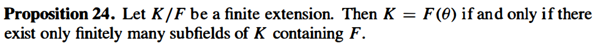

> Proof: omitted.

The primitive generator of $F(a, b, c, \ldots)$ is simply $a+b+c+\cdots$.

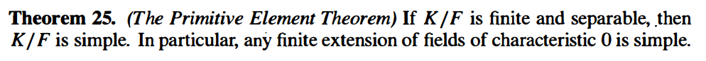

> Proof:
>
> Let L be the Galois closure of K over F. Then any subfield of K containing F corresponds to a subgroup of the Galois group $\gal(L/F)$ by the Fundamental Theorem.  Since there are only finitely many such subgroups (note that $\abs{\gal(L/F)} = [L : F]$ which is finite), the previous proposition shows that $K/F$ is simple.
>
> The last statement follows since any finite extension of fields in characteristic $0$ is simple (proposition 13.34).

#### 14.6 Galois Groups of Polynomials

If $K$ is a Galois extension of $F$, then $K$ is the splitting field of some separable polynomial $f(x) \in F[x]$ of degree $n$. Then any automorphism $\sigma \in \gal(K/F)$ maps a root of $f(x)$ to another root, so $\gal(K/F) \subseteq S_n$.  In general, if $f(x)$ is the product of some irreducibles $f_1(x) \cdots f_k(x)$, then $\gal(K/F) \leq S_{n_1} \times \cdots \times S_{n_k}$.

这里可以把 $s_i$ 理解成一个 function，也可以理解成一个元素.

For any field $F$, $F(x_1, \ldots, x_n)$ is the splitting field of the general polynomial, so it is a Galois extension of $F(s_1, \ldots, s_n)$.

（这里 $F(x_1, \ldots, x_n)$ 既可以指 the field of rational functions，也可以指由这些元素 generate 出来的一个 field. 这两者是同一个东西.

那么对于 $\sigma \in S_n$，把 $\sigma$ 作用在 $x_1, \ldots, x_n$ 上就可以得到一个 $F(x_1, \ldots, x_n)$ 的 automorphism.因此 $S_n \leq \aut(F(x_1, \ldots, x_n))$.

> Proof:
>
> the elementary symmetric functions are fied under any permutation of $S_n$ on their subscipts, so the subfield $F(s_1, \ldots, s_n)$ is contained the fixed field of $S_n$. By the fundamental theorm, the fixed field of $S_n$ has index precisely $n!$ in $F(x_1, \ldots, x_n)$.
>
> Also, since $F(x_1, \ldots, x_n)$ is the splitting field over $F(s_1, \ldots, s_n)$ of the polynomial (14.13), the extension has degree at most $n!$.
>
> Hence $[F(x_1, \ldots, x_n) : F(s_1, \ldots, s_n)] = n!$ and $S_n$ is precisely the fixed field of $F(s_1, \ldots, s_n)$.

> Proof: any symmetric function lies in the fixed field of $S_n$, so it is in the field $F(s_1, \ldots, s_n)$.

> The statement on the book (p622) shows that $x_1, \ldots, x_n$ are independent if and only if $s_1, \ldots, s_n$ are independent.

Over finite fields, tere is no such "generic" polynomial because each every polynomial has a cyclic Galios group (all extensions of finite fields are cyclic).

Over $\Q$ , most polynomials have the full symmetric group as Galois group.

The discriminant is a symmetric function on $x_1, \ldots, x_n$, so it is in the field $F(s_1, \ldots, s_n)$.

> Proof: by the definition of $A_n$.
>
> If $ch(F)=2$,  then $x_i-x_j=x_j-x_i$, so $\sigma$ fixes every square root of $D$.

Since $D$ is symmetric on $F$, $D \in F$, so it can be written as a polynomial over $F$.

> Proof:
>
> by proposition 33, the Galois group is contained in $A_n$ if and only if every element of the Galois group fixes $\sqrt{D}$, if and only if $D \in F$. (这里 $F$ 就是前面的 $F(s_1, \ldots, s_n)$.

- Polynomials of Degree 2
- Polynomials of Degree 3
- Polynomials of Degree 4

> Proof: omitted.

#### 14.7  Solvable and Radical Extensions: Insolvability of the Quintic

Solve for the roots of a polynomial by *radicals*: the algebraic operations of addition, subtraction, multiplication, division and the extraction of $n^{th}$ roots.

The symbol $\sqrt[n]{a}$ for $a \in F$ will be used to denote any root of the polynomial $x^n-a  \in F[x]$.

> proof:
>
> The extension $F(\sqrt[n]{a})$ is the splitting field of the separable polynomial $x^n-a$ which has roots $\sqrt[n]{a}\xi_n^j$, so it is Galois.
>
> For any $\sigma \in \gal(K/F)$, $\sigma(\sqrt[n]{a})=\xi_\sigma\sqrt[n]{a}$ is another root of the polynomial. This gives a map
> $$
> \begin{align}
> \gal(K/F) &\to \mu_n\\
> \sigma &\mapsto \xi_\sigma
> \end{align}
> $$
> Since $F$ contains $\mu_n$, every $n^{th}$ root of unity is fixed by $\gal(K/F)$, so
> $$
> \begin{align}
> \xi_{\sigma\tau}(\sqrt[n]{a})&=\sigma\tau(\sqrt[n]{a})\\
> &= \sigma(\xi_\tau\sqrt[n]{a})\\
> &= \xi_\tau\sigma(\sqrt[n]{a})\\
> &= \xi_\tau\xi_\sigma(\sqrt[n]{a})\\
> &= \xi_{\sigma}\xi_{\tau}(\sqrt[n]{a}),
> \end{align}
> $$
> so the map is a homomorphism.
>
> The kernal fixes $F$ and $\sqrt[n]{a}$, so it fixed all the elements in $F(\sqrt[n]{a})$, and it can only contain the identity.
>
> Since the groups are finite, the map is also surjective
>
> Therefore $\gal(K/F) \cong \mu_n$, and it is cyclic over $F$ of degree $n$.

好多这种求结构的例子都是通过证明同构（或homo）来完成的...

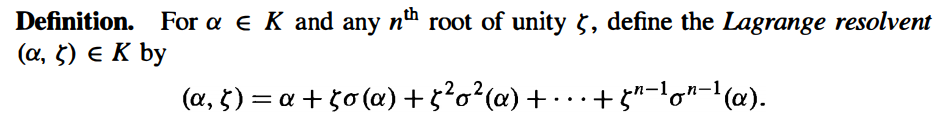

If we apply $\sigma$ to $(\alpha, \xi)$, we will obtain $\xi^{-1}(\alpha, \xi)$,

> Proof:
>
> 
>
> this element cannot lie in any proper subfield of $K$ because ...? **why**

For simplicity we now consider the situation of a base field $F$ of characteristic $0$. 

As in the previous propositions the results are valid over fields whose characteristics do not divide any of the orders of the roots that will be taken.  

(this gives a precise meaning of expressed by the operations

the following example can be found in the book.

> 
>
> where $\sigma K_{i+1} / \sigma K_i$ is again a simple radical extension (since it is generated by the element $\sigma(\sqrt[n_i]{a_i})$, which is a root of the equation $x^{n_i} - a_i$.)
>
> Also, the composite of two root extensions is again a root extension (we can add the subfields one by one: a_i, n_i).
>
> Hence the composite of all of the conjugate fields $\sigma K$ for $\sigma \in \gal(L/F)$ is a again a root extension.
>
> Let the composite field be $C$. Let $K = F(\theta)$ by the Primitive Element Theorem, and $f(x)$ be the minimal polynomial of $\theta$. Then $C$ is the splitting field of $f(x)$ because $\gal(L/F)$ acts transitively on the roots of $f(x)$, so the composite is minimal that contains all the roots of $f(x)$. Also the $f(x)$ is irreducible, so it is separable, and then $C/F$ is Galois. Hence $C = L$.
>
> we see that $\alpha$ is contained in a Galois root extension.
>
> Then, let $F = L_0 \subset L_1 \subset \cdots \subset L_s = L$ be the chain of Galois root extension. We now adjoin to $F$ the $n_i-th$ roots of unity in the chain, obtaining the field $F^\prime$. Then
> $$
> F \subseteq F^\prime = F^\prime L_0 \subseteq F^\prime L_1 \subseteq \cdots \subseteq F^\prime L_s = F^\prime L.
> $$
> The extension from $F$ to $F^\prime$ can be given as a chain of subfields with each individual extension cyclic ($\gal(F(\xi) / F)$ is cyclic, because we can only map one root of $x^n - 1$ to another root, and this is uniquely determined by $\sigma(\xi_n)$ that the map of one primitive root of unity.)
>
> The field $F^\prime L$ is a Galois extension over $F$ because it is the composite of two Galois extensions.
>
> Each $F^\prime L_{i+1} /  F^\prime L_i$ is cyclic by proposition 36. Hence $F^\prime L$ is a Galois root extension with cyclic intermediate extensions.

(好像没有学过 subgroups and quotient groups of solvable groups are solvable?)

> Proof:
>
> First we suppose $f(x)$ can be solved by radicals, then each root of $f(x)$ is contained in an extension as in lemma 38. Let $L$ be the composite of all such extensions, then $L$ is also an extension of the same type.
>
> Let $G_i$ be the subgroups of the galois group corresponding to subfield $K_i$, then $\gal(K_{i+1} / K_i) = G_i / G_{i+1}$. Hence the Galois group $G = \gal(L / F)$ is a solvable group.
>
> Since $L$ contains the splitting field of $f(x)$, the Galois group of $f(x)$ is a quotient group of the solvable group $G$ (by the Fundamental Theorem of Galois Theory), hence is solvable.
>
> .
>
> Conversely, let $G$ be the Galois group of $f(x)$, and $K$ be the splitting field of $f(x)$.
>
> Taking the fixed fields of the subgroups in the chain (14.22) for $G$ gives a chain
> $$
> F = K_0 \sub K_1 \sub \cdots \sub K_s = K.
> $$
> where $K_{i+1} / K_i$ is a cyclic extension of degree $n_i$.
>
> Let $F^\prime$ be the cyclotomic field over $F$ of all roots of unity of order $n_i$. Then
> $$
> F \subseteq F^\prime = F^\prime K_0 \subseteq F^\prime K_1 \subseteq \cdots \subseteq F^\prime K_s = F^\prime K.
> $$
> The extension $F^\prime / F$ is cyclic by the proof of lemma 38.
>
> The extension $F^\prime K_{i+1} / F^\prime K$ is cyclic by the proof of lemma 38, also it has degree dividing $n_i$ by proposition 19. By proposition 37, each such extension is a simple radical extension.
>
> Each root of $f(x)$ is therefore contained in the splitting field $K \subseteq $ the root extension $F^\prime K$ so that $f(x)$ can be solved by radicals.

> For $n \geq 5$ the group $S_n$ is not solvable as we showed in Chapter 4. The corollary follows immediately from Theorems 32 and 39.  

## Orbit-stabilier Theorem

Consider the map $f_x : G \to X$ by $f_x(g) = g \cdot x$. Then $f(g) = f(h) \Leftrightarrow g\cdot x = h \cdot x \Leftrightarrow g^{-1}h\cdot x = x \Leftrightarrow g^{-1}h\in G_x \Leftrightarrow h \in gG_x$. Thus $\abs{G \cdot x} = \abs{G : G_x} = \abs{G} / \abs{G_x}$.

This is proposition 4.1.2.

## Burnside's Lemma

First $\sum_{g \in G}\abs{X^g} = \sum_{g \in G}\sum_{x \in X} [g \cdot x = x] = \sum_{x \in X} \abs{G_x}$.

Then 
$$
\begin{align}
\sum_{x \in X}\abs{G_x} &= \sum_{x \in X} \frac{\abs{G}}{\abs{G \cdot x}}\\
&= \abs{G}\sum_{O \in X / G}\sum_{x \in O}\frac{1}{\abs{O}}\\
&=\abs{G}\abs{X / G}.
\end{align}
$$
Q.E.D..

## Polya Theorem

额。。。算了这不重要。。。

# EOF